PyTorch学习笔记
========
* [安装](#安装)
* [IDE](#IDE)
* [PyTorch数据类型](#PyTorch数据类型)
  * [数据类型说明](#数据类型说明)
  * [标量](#标量)
  * [向量](#向量)
  * [张量初始化](#张量初始化)
* [索引与切片](#索引与切片)
* [维度变换](#维度变换)
* [广播](#广播)
* [拼接与分割](#拼接与分割)
* [数学运算](#数学运算)
* [统计](#统计)
* [比较运算](#比较运算)
* [激活函数](#激活函数)
* [损失和梯度计算](#损失和梯度计算)
* [优化器](#优化器)
* [Visdom可视化](#Visdom可视化)
* [搭建一个简单的全连接分类网络](#搭建一个简单的全连接分类网络)
* [正则化Regularization](#正则化Regularization)
  * [范数](#范数)
  * [深度学习中的正则化](#深度学习中的正则化)
* [学习率](#学习率)
* [早停](#早停)
* [丢弃](#丢弃)
* [卷积](#卷积)
* [池化](#池化)
* [数据的标准化](#数据的标准化)
  * [Batch Normalization](#batch-normalization)
  * [Layer Normalization](#layer-normalization)
  * [Instance Normalization](#instance-normalization)
  * [Group Normalization](#group-normalization)
* [实现残差网络单元](#实现残差网络单元)
* [nn.Module](#nnmodule)
  * [基础用法](#基础用法)
  * [自定义网络层方法](#自定义网络层方法)
  * [实现自己算法的方法](#实现自己算法的方法)
* [模型的保存和加载](#模型的保存和加载)
* [数据增强](#数据增强)
* [搭建一个简单的卷积分类网络](#搭建一个简单的卷积分类网络)
* [RNN](#rnn)
* [时间序列预测](#时间序列预测)
* [LSTM](#lstm)
* [数据集的加载](#数据集的加载)


# 安装
1. 安装Anaconda
2. 打开PyTorch[官网](https://pytorch.org/)
3. 进入Pytorch安装页面，可能是[这个](https://pytorch.org/get-started/locally/)
4. 在“START LOCALLY”标签页里面，根据自己电脑的操作系统和GPU情况，选择好安装条件，复制“Run this Command:”后面的内容
5. 打开Anacoda命令提示符窗口，默认是base虚拟环境（可以创建新的，激活需要的环境），运行上一步复制的命令，完成PyTorch安装

# IDE
* Spyder，Anaconda自带的IDE，启动速度比较满，支持调试，智能提示不好用。
* VSCode，速度快，智能提示好用。

在Anaconda虚拟环境下使用VSCode方法：打开Anaconda命令提示符窗口，zixing```code.exe```启动VSCode，需要python插件，在插件的设置中指定Anacoda安装路径。


# PyTorch数据类型
## 数据类型说明
PyTorch中存储数据的容器叫做张量（Tensor），支持整数和浮点数，不支持字符串，与Python中数据类型对应关系为：
| Python | PyTorch |
| ---- | ---- |
| int | IntTensor of size() |
| float | FloatTensor of size() |
| int array | IntTensor of size [d1,d2,...] |
| float array | FloatTensor of size [d1,d2,...] |
| string | -- |

PyTorch中的张量可以在CPU中也可以在GPU中，使用to device完成。
PyTorch是一个数值计算库，不是完备的编程语言库，因此不需要支持字符串操作，如果需要字符串，可以用编码表示。

## 标量
维度是0的张量，声名方法：
```python
import torch

a = torch.tensor(1)
b = torch.tensor(2.)
print(a, a.type(), a.shape)
print(b, b.type(), b.shape)
```
输出：
```
tensor(1) torch.LongTensor torch.Size([])
tensor(2.) torch.FloatTensor torch.Size([])
```
size是空的方括号（[]）代表标量，在深度学习中，训练中的损失loss就是一个标量。

## 向量
维度大于0的张量，可以理解为数组，支持任意维度。

创建一个2行3列的符合正态分布的随机2维数组：
```python
import torch

a = torch.randn(2, 3)
print(a)
print(a.type())
print(type(a))
print(isinstance(a, torch.FloatTensor))
print(isinstance(a, torch.cuda.FloatTensor))
print(isinstance(a, torch.DoubleTensor))
```
输出：
```
tensor([[-0.1773, -0.4824, -0.1379],
        [ 1.9032, -0.7637, -0.0132]])
torch.FloatTensor
<class 'torch.Tensor'>
True
False
False
```
使用```x = x.cuda()```将CPU中的Tensor转入GPU中，前期需要安装支持CUDA的PyTorch。

1度向量的创建：
```python
import torch

a = torch.tensor([7])
b = torch.tensor([2.])
print(a, a.type(), a.shape)
print(b, b.type(), b.shape)
```
输出：
```
tensor([7]) torch.LongTensor torch.Size([1])
tensor([2.]) torch.FloatTensor torch.Size([1])
```
从numpy数组创建向量：
```python
import torch
import numpy as np

data = np.ones(2)
a = torch.from_numpy(data)
print(data, type(data), data.shape)
print(a, a.type(), a.shape)
# shape转换为python列表
print(list(a.shape))
```
输出：
```
[1. 1.] <class 'numpy.ndarray'> (2,)
tensor([1., 1.], dtype=torch.float64) torch.DoubleTensor torch.Size([2])
[2]
```

## 张量初始化
```python
import torch

# 为初始化的张量，具有内存中原有的数据，最好不要使用这种方法初始化
a = torch.empty(2, 5)
print('a:', a)

# 随机初始化张量
# 初始化[0,1]之间的均匀分布的张量
b = torch.rand(2, 5)
print('b:', b)

# 初始化标准正太分布的张量
c = torch.randn(2, 5)
print('c:', c)

# 创建一个与已有张量同样形状的张量
d = torch.rand_like(a)
print('d:', d)

# 创建一个整数张量，指定最小值和最大值整数，包括最小值，不包括最大值，放回取样
# 最后一个参数是维度
e = torch.randint(3, 6, [2, 4])
print('e:', e)

# 创建一个数列，第三个参数可以指定间隔（步长）
f = torch.arange(2, 10).reshape(2, 4)
print('f:', f)
# 在开始和结束区间内创建第三个参数指定个数的数列，包括两端点
f1 = torch.linspace(2, 10, 3)
print('f1:', f1)

# 创建一个全部是同一个数值的张量
g = torch.full([3, 2], 7)
print('g:', g)

# 创建全是1的张量
h = torch.ones(3, 2)
print('h:', h)

# 创建全是0的张量
i = torch.ones(3, 2)
print('i:', i)

# 创建单位矩阵
j = torch.eye(3)
print('j:', j)
j1 = torch.eye(3, 4)
print('j1', j1)

# 创建一个随机打散的索引张量
k = torch.randperm(10)
print('k:', k)
```
输出：
```
a: tensor([[0., 0., 0., 0., 0.],
        [0., 0., 0., 0., 0.]])
b: tensor([[0.6758, 0.9819, 0.7428, 0.5941, 0.6671],
        [0.5848, 0.2866, 0.6752, 0.1474, 0.6199]])
c: tensor([[-0.9216,  0.7161, -0.6093,  0.5157,  0.9894],
        [-1.7610, -0.9583, -1.2302, -0.5157,  0.8143]])
d: tensor([[0.0291, 0.7307, 0.4028, 0.6687, 0.5023],
        [0.4898, 0.4763, 0.1095, 0.9657, 0.8446]])
e: tensor([[3, 3, 5, 3],
        [5, 5, 4, 5]])
f: tensor([[2, 3, 4, 5],
        [6, 7, 8, 9]])
f1: tensor([ 2.,  6., 10.])
g: tensor([[7, 7],
        [7, 7],
        [7, 7]])
h: tensor([[1., 1.],
        [1., 1.],
        [1., 1.]])
i: tensor([[1., 1.],
        [1., 1.],
        [1., 1.]])
j: tensor([[1., 0., 0.],
        [0., 1., 0.],
        [0., 0., 1.]])
j1 tensor([[1., 0., 0., 0.],
        [0., 1., 0., 0.],
        [0., 0., 1., 0.]])
k: tensor([9, 3, 4, 7, 0, 6, 5, 2, 1, 8])
```


# 索引与切片
```python
import torch

# 创建一个4维向量，一般是图像识别网络的输入（batch_size, channel, width, height)
a = torch.rand(4, 3, 28, 28)

# 维度的索引从0开始，小于维度的数目，从左面开始
# 取第0个维度的第0项目，是一个3维的向量
print('a[0] shape:', a[0].shape)

# []内用逗号间隔维度
# 取维度0的第1个项目， 是一个2维的向量
print('a[1,2] shape:', a[1, 2].shape)
# 指定所有维度，取到的是一个标量
print('a[2,1,3,5) shape:', a[2, 1, 3, 5].shape)

# 使用冒号指定范围，冒号前面是开始位置，后面是结束位置，不知道默认开始或者结尾
# 取第0维度的前2项，其它维度全部取，取到的是4维数据，第0维的数量是2
print('a[:2] shape:', a[:2].shape)
# 取第0维度中间2项，第3维度的第10项后面的数据，得到（2，3，18，28）的向量
print('a[1:3,:,10:] shape:', a[1:3, :, 10:].shape)

# 第二个冒号表示步长
# 取第0维度中间2项，第3维度的第10项后面间隔1项取1个，得到（2，3，9，28）的向量
print('a[1:3,:,10::2] shape:', a[1:3, :, 10::2].shape)

# 使用索引数组选择项
# 取第三个通道的3、5项，得到(4,3,28,2)
print('a.index_select(3,[3,5]) shape:',
      a.index_select(3, torch.tensor([3, 5])).shape)

# 取所有维度所有数据
print('a[...] shape:', a[...].shape)
# 最后一个维度取前2项，得到（4，3，28，2）
print('a[...,:2] shape:', a[..., :2].shape)

# 使用掩码向量选择数据
# 得到大于1的项的掩码向量,mask是一个（4，3，28，28）的向量，a中大于0.5的项目对应mask位置是True，其它地方是False
mask = a > 0.5
print('mask part data:', mask[0, 0, 0])
# 通过掩码选择后的数据拉直为一个1维向量，长度等于a中大于0.5项的个数
print('a中大于0.5的项:', a.masked_select(mask))

# 拉直成1维向量根据位置取项
print('a拉直后的2、3项:', a.take(torch.tensor([2, 3])))
```
输出：
```
a[0] shape: torch.Size([3, 28, 28])
a[1,2] shape: torch.Size([28, 28])
a[2,1,3,5) shape: torch.Size([])
a[:2] shape: torch.Size([2, 3, 28, 28])
a[1:3,:,10:] shape: torch.Size([2, 3, 18, 28])
a[1:3,:,10::2] shape: torch.Size([2, 3, 9, 28])
a.index_select(3,[3,5]) shape: torch.Size([4, 3, 28, 2])
a[...] shape: torch.Size([4, 3, 28, 28])
a[...,:2] shape: torch.Size([4, 3, 28, 2])
mask part data: tensor([ True, False, False,  True,  True, False, False,  True, False, False,
         True,  True,  True,  True, False,  True, False, False, False,  True,
        False,  True, False, False,  True, False, False, False])
a中大于0.5的项: tensor([0.9761, 0.9434, 0.8226,  ..., 0.7555, 0.6995, 0.6488])
a拉直后的2、3项: tensor([0.4858, 0.9434])
```

# 维度变换
| 操作 | 说明 |
| --- | --- |
| View/reshape | 保持项目总数量和顺序不变的情况下，改变维度 |
| Squeeze/unsqueeze | 挤压长度是1的维度/增加长度为1的维度 |
| Transpose/t/permute | 矩阵的转置 |
| Expand/repeat | 维度的扩展 |

view和reshape完全一样，为了与numpy一致，使用reshape更习惯一些。
```python
import torch

a = torch.rand(4, 1, 28, 28)
print('a shape:', a.shape)

# reshape
a = a.reshape(4, 28, 28)
print('reshape:', a.shape)

# unsqueeze
# 在第1个维度前面插入一个维度，得到(4,1,28,28)
a = a.unsqueeze(1)
print('unsqueeze(1):', a.shape)
# 在最后面插入一个维度，得到(4,1,28,28,1)
a = a.unsqueeze(-1)
print('unsqueeze(-1):', a.shape)

# squeeze，指定一个要删减的维度，对长度不是1维度无效，不指定删除全部长度是1的维度
# 删减第0个维度，第0个维度长度是4，操作不做任何改变，得到(4,1,28,28,1)
a = a.squeeze(0)
print('squeeze(0):', a.shape)
# 删减所有长度是1的维度，得到(4,28,28)
a = a.squeeze()
print('squeeze():', a.shape)

# expand，广播模式，不会复制数据，效率高，节省内存
a = a.unsqueeze(1)
# 将a的第1个维度（一般代表图片的色彩通道数，1是灰度，3是彩色）扩展到3
# 被扩展的维度的长度原来必须是1，原来是（4，1，28，28），扩展后是（4，3，28，28）
a = a.expand(-1, 3, -1, -1)
print('a.expend(-1,3,-1,-1):', a.shape)

# repeat，拷贝数据，参数指定每个维度拷贝的次数
# 第0个维度拷贝2次，第1个维度拷贝1次，第2、3维度拷贝10次，得到（8，3，280，280）
a = a.repeat(2, 1, 10, 10)
print('a.repeat(2,1,10,10):', a.shape)

# t()/T，矩阵的转置，只能用于2维矩阵
# transpose，交换维度，可以用于任何维度的向量
# 交换0和1维度，得到（3，8，280，280）,
# 交换后内存的数据不连续，需要使用contiguous()让数据连续，然后才可以做reshape操作，否则reshape得到是交换前数据顺序
a = a.transpose(0, 1)
print('a.transpose(0,1):', a.shape)
```
输出：
```
a shape: torch.Size([4, 1, 28, 28])
reshape: torch.Size([4, 28, 28])
unsqueeze(1): torch.Size([4, 1, 28, 28])
unsqueeze(-1): torch.Size([4, 1, 28, 28, 1])
squeeze(0): torch.Size([4, 1, 28, 28, 1])
squeeze(): torch.Size([4, 28, 28])
a.expend(-1,3,-1,-1): torch.Size([4, 3, 28, 28])
a.repeat(2,1,10,10): torch.Size([8, 3, 280, 280])
a.transpose(0,1): torch.Size([3, 8, 280, 280])
```

# 广播
```python
import torch

a = torch.tensor([[1, 2], [3, 4], [5, 6]])
print('a shape:', a.shape)
print('a data:', a)

b = torch.tensor([3])
print('b shape:', b.shape)
print('b data:', b)

# 广播是从最小维度匹配
# 计算a+b时，b通过广播扩展为（3,2)维度，每个元素都是3
print('a+b:', a+b)

# 匹配最后一个维度，长度必须等于a最后一个维度的长度，每个元素分别操作
c = torch.tensor([2, 1])
print('a+c:', a+c)

# a的维度是[4,32,28,30],b的维度是[1,32,1,1]
# a+b也是可以广播的，32不变，第一个1变为4，第二个1变为28，第三个1变为30
# a+b得到的维度是[4,32,28,30]
```
输出：
```
a shape: torch.Size([3, 2])
a data: tensor([[1, 2],
        [3, 4],
        [5, 6]])
b shape: torch.Size([1])
b data: tensor([3])
a+b: tensor([[4, 5],
        [6, 7],
        [8, 9]])
a+c: tensor([[3, 3],
        [5, 5],
        [7, 7]])
```

# 拼接与分割
| 操作 | 说明 |
| --- | --- |
| cat | 连接多个向量的某一维度，其它维度必须一样 |
| stack | 叠加多个向量的某一维度，被叠加向量的所有维度必须一样，得到叠加向量在指定叠加维度前面增加了一个维度，长度等于被叠加向量的个数 |
| split | 在指定维度上拆分，指定返回的每个向量拆分维度的长度，返回一个元组，维度不变 |
| chunk | 指定返回向量拆分维度的长度进行拆分，返回一个元组，数量根据每个的数量计算，最后一个小于等于指定长度 |

```python
import torch

# cat,从指定的维度上连接，不指定默认为0维度
# 在默认0维度上链接，其它维度必须一致
a = torch.rand(5, 12, 7)
b = torch.rand(10, 12, 7)
c = torch.cat([a, b])
print('a b cat at dim 0 shape:', c.shape)

# 在1维度上连接
a = torch.rand(5, 12, 7)
b = torch.rand(5, 2, 7)
c = torch.cat([a, b], dim=1)
print('a b cat at dim 1 shape:', c.shape)

# stack，相加的维度前面增加一个新的维度
# 叠加的向量维度必须一样
a = torch.rand(5, 8, 7)
b = torch.rand(5, 8, 7)
c = torch.rand(5, 8, 7)
d = torch.stack([a, b, c], dim=1)
print('a b c stack at dim 1 shape:', d.shape)

# split，指定长度拆分
a = torch.rand(5, 3, 2)
b, c = a.split([2, 3])
print('b shape:', b.shape)
print('c shape:', c.shape)

# chunk，指定个数拆分
d = a.chunk(3)
print('d len:', len(d))
print('d[0] shape:', d[0].shape)
print('d[1] shape:', d[1].shape)
print('d[2] shape:', d[2].shape)
```
输出：
```
a b cat at dim 0 shape: torch.Size([15, 12, 7])
a b cat at dim 1 shape: torch.Size([5, 14, 7])
a b c stack at dim 1 shape: torch.Size([5, 3, 8, 7])
b shape: torch.Size([2, 3, 2])
c shape: torch.Size([3, 3, 2])
d len: 3
d[0] shape: torch.Size([2, 3, 2])
d[1] shape: torch.Size([2, 3, 2])
d[2] shape: torch.Size([1, 3, 2])
```

# 数学运算
标量预算没有特别之处，主要需要了解是向量的运算
```python
import torch

# +、-、*、/，对应元素加、减、乘、除，支持广播
a = torch.rand(3, 4)
print('a shape:', a.shape)
b = torch.rand(4)
print('b shape:', b.shape)
print('a+b shape:', (a+b).shape)

# 矩阵乘法，mm只支持2维矩阵乘法，@/matmul支持多维矩阵
# 多维矩阵乘法对最后2个维度做矩阵乘法，前面的维度支持广播，一一对应
a = torch.rand(4, 3, 28, 64)
print('a shape:', a.shape)
b = torch.rand(4, 1, 64, 28)
print('b shape:', b.shape)
print('a@b shape:', (a@b).shape)

# **n/pow(n) n次方，sqrt开方，rsqrt平凡跟倒数
a = torch.tensor([[2, 3], [4, 5]])
print('a:', a)
print('a的平方：', a**2)
print('a的3次方：', a.pow(3))
print('a的平方根：', a.sqrt())
print('a的平方根倒数：', a.rsqrt())

# log,对数，e为底的对数，其它低速的函数：log10,log2
print('[e,e]的log:', torch.tensor([2.7183, 2.7183]).log())

# floor向下取整,ceil向上取整,trunc取整数部分,frac取小数部分,round四舍五入
a = torch.tensor(3.14)
print('a: ', a)
print('floor       ceil        trunc         frac')
print(a.floor(), a.ceil(), a.trunc(), a.frac())

# clamp，裁剪，限制数据的范围
a = torch.tensor([[1, 2, 3], [4, 5, 6]])
print('a:', a)
print('a.clamp(4):', a.clamp(4))
print('a.clamp(3,5):', a.clamp(3, 5))
```
输出：
```
a shape: torch.Size([3, 4])
b shape: torch.Size([4])
a+b shape: torch.Size([3, 4])
a shape: torch.Size([4, 3, 28, 64])
b shape: torch.Size([4, 1, 64, 28])
a@b shape: torch.Size([4, 3, 28, 28])
a: tensor([[2, 3],
        [4, 5]])
a的平方： tensor([[ 4,  9],
        [16, 25]])
a的3次方： tensor([[  8,  27],
        [ 64, 125]])
a的平方根： tensor([[1.4142, 1.7321],
        [2.0000, 2.2361]])
a的平方根倒数： tensor([[0.7071, 0.5774],
        [0.5000, 0.4472]])
[e,e]的log: tensor([1.0000, 1.0000])
a:  tensor(3.1400)
floor       ceil        trunc         frac
tensor(3.) tensor(4.) tensor(3.) tensor(0.1400)
a: tensor([[1, 2, 3],
        [4, 5, 6]])
a.clamp(4): tensor([[4, 4, 4],
        [4, 5, 6]])
a.clamp(3,5): tensor([[3, 3, 3],
        [4, 5, 5]])
```


# 统计
| 操作 | 说明 |
| --- | --- |
| norm | 求二范数 |
| mean | 求均值 |
| sum | 求和 |
| prod | 累乘 |
| max、min、argmax、argmin | 最大、最小值，最大、最小值的索引 |
| kthvalue、topk | 第几个的值、前几个的值 |

```python

import torch

a = torch.full([8], 1.)
b = a.view(2, 4)
c = a.view(2, 2, 2)
print('a:', a, a.shape)
print('b:', b, b.shape)
print('c:', c, c.shape)

# norm
# 1范数，所有元素的和
print('a.norm(1):', a.norm(1))
print('b.norm(1):', b.norm(1))
print('c.norm(1):', c.norm(1))
# 2范数，所有元素的平方和再开方
print('a.norm(2):', a.norm(2))
print('b.norm(2):', b.norm(2))
print('c.norm(2):', c.norm(2))
# 指定维度的范数,维度的理解不太清楚，大约是取那个维度就消掉那个维度
print('b.norm(1,dim=1):', b.norm(1, dim=1))
print('c.norm(1,dim=1):', c.norm(1, dim=1))
print('c.norm(1,dim=0):', c.norm(1, dim=0))

# mean、sum、max、min、prod，argmax、argmin
a = torch.arange(1, 9).view(2, 4).float()
print('a:', a)
print('a.mean():', a.mean())
print('a.sum():', a.sum())
print('a.max():', a.max())
print('a.min():', a.min())
print('a.prod(),累乘:', a.prod())
print('a.argmax():', a.argmax())
print('a.argmin(1):', a.argmin(1))
print('a.argmin(1,keepdim=True):', a.argmin(1, keepdim=True))
print('a.topk(2),largest=Flase返回最小的k个:', a.topk(2))
print('a.kthvalue(2),第k小的:', a.kthvalue(2))
```
输出：
```
a: tensor([1., 1., 1., 1., 1., 1., 1., 1.]) torch.Size([8])
b: tensor([[1., 1., 1., 1.],
        [1., 1., 1., 1.]]) torch.Size([2, 4])
c: tensor([[[1., 1.],
         [1., 1.]],

        [[1., 1.],
         [1., 1.]]]) torch.Size([2, 2, 2])
a.norm(1): tensor(8.)
b.norm(1): tensor(8.)
c.norm(1): tensor(8.)
a.norm(2): tensor(2.8284)
b.norm(2): tensor(2.8284)
c.norm(2): tensor(2.8284)
b.norm(1,dim=1): tensor([4., 4.])
c.norm(1,dim=1): tensor([[2., 2.],
        [2., 2.]])
c.norm(1,dim=0): tensor([[2., 2.],
        [2., 2.]])
a: tensor([[1., 2., 3., 4.],
        [5., 6., 7., 8.]])
a.mean(): tensor(4.5000)
a.sum(): tensor(36.)
a.max(): tensor(8.)
a.min(): tensor(1.)
a.prod(),累乘: tensor(40320.)
a.argmax(): tensor(7)
a.argmin(1): tensor([0, 0])
a.argmin(1,keepdim=True): tensor([[0],
        [0]])
a.topk(2),largest=Flase返回最小的k个: torch.return_types.topk(
values=tensor([[4., 3.],
        [8., 7.]]),
indices=tensor([[3, 2],
        [3, 2]]))
a.kthvalue(2),第k小的: torch.return_types.kthvalue(
values=tensor([2., 6.]),
indices=tensor([1, 1]))
```

# 比较运算
```python
import torch

#  >、>=、<、<=、!=、==，返回与原向量同形的True、False对比结果向量
a = torch.arange(1, 9).view(2, 4).float()
print('a:', a)
print('a>2:', a > 2)

# where 条件筛选
cond = torch.tensor([[1, 1, 2, 2], [2, 2, 1, 1]])
print('条件cond：', cond)
b = torch.ones(8).reshape(2, 4)
print('b:', b)
print('a.where(cond<2,b):', a.where(cond < 2, b))

# gather,查表操作，将原表的一个维度的数值作为字典表的索引，替换成字典表的值
a = torch.tensor([[1, 0, 1], [0, 0, 0]])
b = torch.tensor([8, 9, 10])
print('torch.gather(b.expand(2,3),dim=1,index=a):',
      torch.gather(b.expand(2, 3), dim=1, index=a))
```
输出：
```
a: tensor([[1., 2., 3., 4.],
        [5., 6., 7., 8.]])
a>2: tensor([[False, False,  True,  True],
        [ True,  True,  True,  True]])
条件cond： tensor([[1, 1, 2, 2],
        [2, 2, 1, 1]])
b: tensor([[1., 1., 1., 1.],
        [1., 1., 1., 1.]])
a.where(cond<2,b): tensor([[1., 2., 1., 1.],
        [1., 1., 7., 8.]])
torch.gather(b.expand(2,3),dim=1,index=a): tensor([[9, 8, 9],
        [8, 8, 8]])
```


# 激活函数
```python
import torch

a = torch.linspace(-100, 100, 10)
print('a:', a)

# sigmoid，可以看到当x较大或者较小时的值都是1和0，梯度消失了
print('sigmoid(a):', torch.sigmoid(a))

# ReLU，有效的防止了梯度的消失
print('relu(a):', torch.relu(a))
```
输出：
```
a: tensor([-100.0000,  -77.7778,  -55.5556,  -33.3333,  -11.1111,   11.1111,
          33.3333,   55.5556,   77.7778,  100.0000])
sigmoid(a): tensor([0.0000e+00, 1.6655e-34, 7.4564e-25, 3.3382e-15, 1.4945e-05, 9.9999e-01,
        1.0000e+00, 1.0000e+00, 1.0000e+00, 1.0000e+00])
relu(a): tensor([  0.0000,   0.0000,   0.0000,   0.0000,   0.0000,  11.1111,  33.3333,
         55.5556,  77.7778, 100.0000])
```


# 损失和梯度计算
```python
import torch
import torch.nn as nn
from torch.nn import functional as F

# 均方差损失，MSE
x = torch.tensor(2.)
print('x:', x)
# 需要求导的张量必须将requires_grad设置为True
w = torch.full([1], 3., requires_grad=True)
print('w:', w)
mse = F.mse_loss(torch.tensor([5.7]), x*w)
print('mse loss(2*3-5.7)**2=0.09:', mse)

# 损失对w的梯度，导函数在x点的值
print('d(loss)/d(w)=2*(x*w-5.7)*x=2*(2*3-5.7)*2:',
      torch.autograd.grad(mse, [w]))

# 第二种方法计算梯度，backward方法
# 上面读取了一次梯度后没有设置保留，不能第二次读取，需要再次计算
mse = F.mse_loss(torch.tensor([5.7]), x*w)
mse.backward()
print('mse.backward(), w.grad:', w.grad)

# 用于分类的softmax，网络的输出通过softmax转换成概率
logits = torch.rand(3, requires_grad=True)
print('logits:', logits)
pred = F.softmax(logits, dim=0)
print('pred:', pred)
print('pred sum:', pred.sum())
# pred.backward()会报错，backward只能对标量进行
# 查看logits的导数值，注意必须设置保留计算图，否则无法获取后面2个元素的导数值
print('d(pred[0])/logits grads:',
      torch.autograd.grad(pred[0], [logits], retain_graph=True))
print('d(pred[1])/logits grads:',
      torch.autograd.grad(pred[1], [logits], retain_graph=True))
print('d(pred[2])/logits grads:',
      torch.autograd.grad(pred[2], [logits], retain_graph=True))
# 定义真是的标签
labels = torch.tensor([1., 0, 0])
print('labels:', labels)
# 定义交叉熵对象
criteon = nn.CrossEntropyLoss()
# 计算交叉熵损失,需要2维的向量，第0维是批次，第1维是预测概率和实际标签
loss = criteon(pred.unsqueeze(0), labels.unsqueeze(0))
print('loss:', loss)
# 后向传播
loss.backward()
# 显示梯度
print('d(loss)/logits grads:', logits.grad)
```
输出：
```
x: tensor(2.)
w: tensor([3.], requires_grad=True)
mse loss(2*3-5.7)**2=0.09: tensor(0.0900, grad_fn=<MseLossBackward0>)
d(loss)/d(w)=2*(x*w-5.7)*x=2*(2*3-5.7)*2: (tensor([1.2000]),)
mse.backward(), w.grad: tensor([1.2000])
logits: tensor([0.4118, 0.6768, 0.7699], requires_grad=True)
pred: tensor([0.2678, 0.3491, 0.3831], grad_fn=<SoftmaxBackward0>)
pred sum: tensor(1.0000, grad_fn=<SumBackward0>)
d(pred[0])/logits grads: (tensor([ 0.1961, -0.0935, -0.1026]),)
d(pred[1])/logits grads: (tensor([-0.0935,  0.2272, -0.1337]),)
d(pred[2])/logits grads: (tensor([-0.1026, -0.1337,  0.2363]),)
labels: tensor([1., 0., 0.])
loss: tensor(1.1653, grad_fn=<DivBackward1>)
d(loss)/logits grads: tensor([-0.2025,  0.0944,  0.1081])
```


# 优化器
求Himmelblau二元函数的最小值的x,y

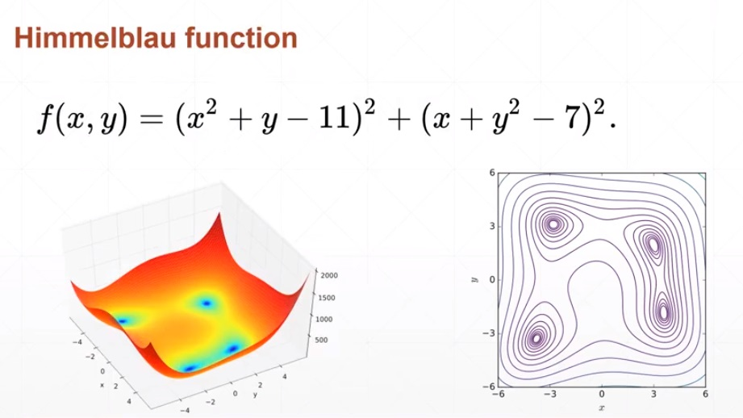

函数的最小值点：

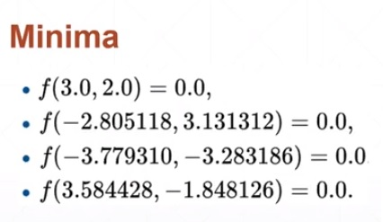

使用matplotlib绘制函数曲面：
```python
import numpy as np
from matplotlib import pyplot as plt


def himmelblau(x):
    # 定义himmelblau函数，传入一个1位数组，有2个元素，x[0]代表x，x[1]代表y
    return (x[0]**2+x[1]-11)**2+(x[0]+x[1]**2-7)**2


# 生成x、y±6之间的网格数据，间隔0.1
x = np.arange(-6, 6, 0.1)
y = np.arange(-6, 6, 0.1)
X, Y = np.meshgrid(x, y)
print('X,Y maps:', X.shape, Y.shape)

# 计算函数值,传入了两个二维向量，对应元素计算函数值，返回一个[120,120]的向量
Z = himmelblau([X, Y])
print('Z shape:', Z.shape)

# 显示函数的曲面
fig = plt.figure('himmelblau')
ax = fig.add_subplot(111, projection='3d')
ax.plot_surface(X, Y, Z)
ax.view_init(30, -30)  # 沿着Z轴旋转30°，沿着Y轴旋转-30
ax.set_xlabel('x')
ax.set_ylabel('y')
plt.show()
```
输出：
```
X,Y maps: (120, 120) (120, 120)
Z shape: (120, 120)
```
画出来的函数曲面图：

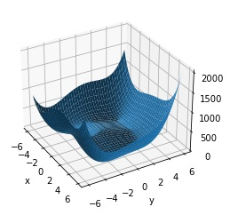

使用梯度下降方法求函数的最小值：
```python
import torch


def himmelblau(x):
    # 定义himmelblau函数，传入一个1位数组，有2个元素，x[0]代表x，x[1]代表y
    return (x[0]**2+x[1]-11)**2+(x[0]+x[1]**2-7)**2


# 从（0,0）点开始沿着梯度下降方向寻找函数的最小值点
x = torch.tensor([0., 0.], requires_grad=True)
# 定义一个优化器
optimizer = torch.optim.Adam([x], lr=1e-3)  # 优化对象是x向量，学习率是0.001
for step in range(20000):
    # 计算当前点的函数值
    z = himmelblau(x)
    
    # 优化器的用法：梯度先清零，函数值反向传播，优化器调整下一步的X值
    optimizer.zero_grad()
    z.backward()
    optimizer.step()

    if step % 2000 == 0:
        print('step {}: x={}, f(x)={}'.format(step, x.tolist(), z.item()))
```
输出：
```
step 0: x=[0.0009999999310821295, 0.0009999999310821295], f(x)=170.0
step 2000: x=[2.3331806659698486, 1.9540694952011108], f(x)=13.730916023254395
step 4000: x=[2.9820079803466797, 2.0270984172821045], f(x)=0.014858869835734367
step 6000: x=[2.999983549118042, 2.0000221729278564], f(x)=1.1074007488787174e-08
step 8000: x=[2.9999938011169434, 2.0000083446502686], f(x)=1.5572823031106964e-09
step 10000: x=[2.999997854232788, 2.000002861022949], f(x)=1.8189894035458565e-10
step 12000: x=[2.9999992847442627, 2.0000009536743164], f(x)=1.6370904631912708e-11
step 14000: x=[2.999999761581421, 2.000000238418579], f(x)=1.8189894035458565e-12
step 16000: x=[3.0, 2.0], f(x)=0.0
step 18000: x=[3.0, 2.0], f(x)=0.0
```
找到了函数的一个最小值点(3,2)，x初始化不同的位置，可以找到临近的另外3个最小值点。

动量（momentum）：torch.optim.SDG的momentum参数，取值范围0~1，代表取上一次梯度向量大小的比例，用乘以这个比例的上一次梯度向量与本次的梯度向量相加，得到本次更新的最终向量，这样可以避免陷入局部最小值出不来，造成网络训练效果差。torch.optim.Adam函数中没有momentum参数，Adam算法内置了动量的支持。


# Visdom可视化
安装：pip install visdom
启动服务：
```
python -m visdom.server
```
启动成功后显示查看图标的网站，一般是 `http://localhost:8097/`
如果能打开这个网页，表示启动成功了。
在python程序中想visdom服务添加数据，实时显示图表。

在网页中添加一个图标：
```python
from visdom import Visdom
viz=Visdom()
viz.line([[0.,0.]],[0.],win='train1',opts={'title':'train loss&acc','legend':['loss','acc.']})
```
上面代码在visdom网页中初始化了一个窗口，显示了训练的loss和acc.，第一个参数提供一个数组，指定Y的第一个值，第二个参数指定X的第一个值，第三个参数是窗口的名字，第四个参数是图标的名字，第五个参数对应Y数据的标题

实时添加数据：
```python
viz.line([[loss.item(),acc.item()]],[global_step],win='train1', update='append')
```


# 搭建一个简单的全连接分类网络
```pthin
import torch
import torch.nn as nn
import torch.optim as optim
from torch.nn import functional as F
from torchvision import datasets, transforms
from visdom import Visdom

# 定义批次、学习率、训练次数
batch_size = 200
learning_rate = 1e-3
epochs = 10

# 使用手写数字数据集，做一个0~9手写数字的识别
# 加载训练集
train_loader = torch.utils.data.DataLoader(
    datasets.MNIST('./data', train=True, download=True,
                   transform=transforms.Compose([
                       transforms.ToTensor(),
                       transforms.Normalize((0.1307,), (0.3081,))
                   ])),
    batch_size=batch_size, shuffle=True)
# 加载测试集
test_loader = torch.utils.data.DataLoader(
    datasets.MNIST('./data', train=False, transform=transforms.Compose([
        transforms.ToTensor(),
        transforms.Normalize((0.1307,), (0.3081,))
    ])),
    batch_size=batch_size, shuffle=True)

# 定义网络，一个4层的全连接网络
# 第1层784个神经元，等于图像的像素个数，灰度图像,28*28，共782个像素
w1, b1 = torch.randn(300, 784, requires_grad=True), torch.randn(
    300, requires_grad=True)
# 第2层300个神经元，因此第1层输出就是300
w2, b2 = torch.randn(200, 300, requires_grad=True), torch.randn(
    200, requires_grad=True)
# 第3层200个神经元，因此第2层输出就是200
w3, b3 = torch.randn(100, 200, requires_grad=True), torch.randn(
    100, requires_grad=True)
# 第4层100个神经元，因此第3层输出就是100，共10个标签（0~9），输出为标签数量
w4, b4 = torch.randn(10, 100, requires_grad=True), torch.randn(
    10, requires_grad=True)

# 用正态分布初始化参数，这样才能在训练中找到全局最小值，否则找到的是局部最小值
torch.nn.init.kaiming_normal(w1)
torch.nn.init.kaiming_normal(w2)
torch.nn.init.kaiming_normal(w3)
torch.nn.init.kaiming_normal(w4)


def forward(x):
    # 前向传播函数
    x = x@w1.T+b1
    x = F.relu(x)

    x = x@w2.T+b2
    x = F.relu(x)

    x = x@w3.T+b3
    x = F.relu(x)

    x = x@w4.T+b4
    x = F.relu(x)

    return x


# 优化器，使用Adam
optimizer = optim.Adam([w1, b1, w2, b2, w3, b3], lr=learning_rate)

# 损失函数，交叉熵
criteon = nn.CrossEntropyLoss()

# 可视化训练过程，使用Visdom，观察训练集的损失和准去率
viz = Visdom()
viz.line([[0., 0.]], [0.], win='train1', opts={
         'title': 'train loss&acc', 'legend': ['loss', 'acc.']})

# 训练
global_step = 0
for epoch in range(epochs):
    for batch_idx, (data, target) in enumerate(train_loader):
        # 彩色通道是1，去掉它
        data = data.view(-1, 28*28)

        # 得到网络的推断的特征向量
        logits = forward(data)
        # 这一步做了sofmat和交叉熵损失
        loss = criteon(logits, target)

        # 反向传播，调整参数w和b
        optimizer.zero_grad()
        loss.backward()
        optimizer.step()

        # 每训练10次显示一组数据到Visdom中
        if batch_idx % 10 == 0:
            pred = logits.argmax(1)
            acc = pred.eq(target).sum()/len(target)
            viz.line([[loss.item(), acc.item()]], [global_step],
                     win='train1', update='append')
            global_step += 1
            viz.images(data.view(-1, 1, 28, 28)[0:10], win='x')
            viz.text(str(pred.detach().numpy()),
                     win='pred', opts={'title': 'pred'})

        # 每100次打印一次训练结果
        if batch_idx % 100 == 0:
            print('Train Epoch: {} [{}/{} ({:.0f}%)]\tLoss: {:.6f}'.format(
                epoch, batch_idx * len(data), len(train_loader.dataset),
                100. * batch_idx / len(train_loader), loss.item()))

    # 训练结束，测试模型的性能
    test_loss = 0
    correct = 0
    for data, target in test_loader:
        data = data.view(-1, 28*28)
        logits = forward(data)

        # 累加测试集上的损失
        test_loss += criteon(logits, target)

        # 从特征向量数组中过滤出每个向量最大值的索引，这个索引对应就是数字
        pred = logits.data.max(1)[1]
        # 与标签对比，累加正确的识别的图像数量
        correct += pred.eq(target.data).sum()

    #
    test_loss /= len(test_loader.dataset)
    print('\nTest set: Average loss: {:.4f}, Accuracy: {}/{} ({:.0f}%)\n'.format(
        test_loss, correct, len(test_loader.dataset),
        100. * correct / len(test_loader.dataset)))
```
输出：
```
....
Test set: Average loss: 0.0015, Accuracy: 8905/10000 (89%)

Train Epoch: 9 [0/60000 (0%)]	Loss: 0.255767
Train Epoch: 9 [20000/60000 (33%)]	Loss: 0.268368
Train Epoch: 9 [40000/60000 (67%)]	Loss: 0.171398

Test set: Average loss: 0.0014, Accuracy: 8932/10000 (89%)
```
训练过程中损失和准确率变化曲线：

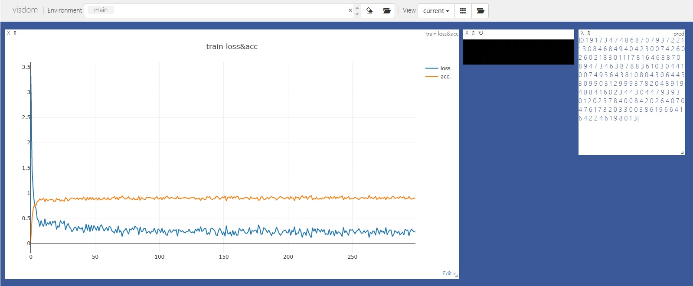


# 正则化Regularization
## 范数
范数是衡量某个向量空间（或矩阵）中的每个向量以长度或大小。范数的一般化定义：对实数p>=1， 范数定义如下：


* L1范数：当p=1时，是L1范数，其表示某个向量中所有元素绝对值的和。
* L2范数：当p=2时，是L2范数， 表示某个向量中所有元素平方和再开根， 也就是欧几里得距离公式。

## 深度学习中的正则化
* L1正则化（Lasso回归）算法：

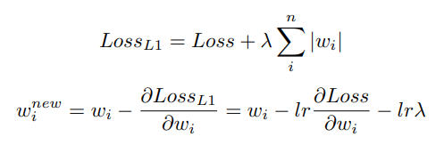
* L2正则化（岭回归）算法：

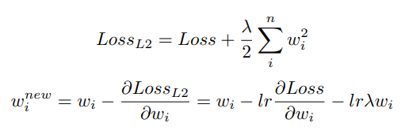

* 弹性网回归算法：

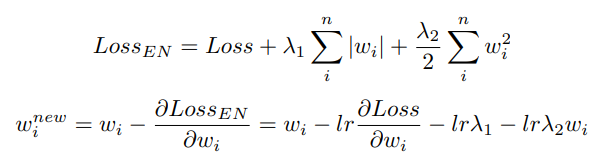

PyTorch中没有L1正则化和弹性网回归的实现，L2正则化示例如下：
```python
import torch
import torch.nn as nn

# 构建一个1层的神经网络，使用2个神经元，输入3个数字，输出2个数字
# 每次输入2组数据
labels = torch.tensor([[0, 1.], [1, 0]])
ce = nn.CrossEntropyLoss()

# 不使用L2正则化
print('----- not L2 regularization -----')
w1 = torch.tensor([[1, 1.2, 1.3], [1.1, 0.9, 1.4]], requires_grad=True)
x1 = torch.tensor([[12., 11., 10.], [15., 14., 13.]])

optimizer1 = torch.optim.SGD([w1], lr=0.1)

logits1 = x1@w1.T
print('logits1=x1@w1.T:', logits1)

loss1 = ce(logits1, labels)
print('ce loss:', loss1)
w1_grad = torch.autograd.grad(loss1, w1, retain_graph=True)
print('d(loss1)/d(w1):', w1_grad)
print('manual cal new w1, w1-lr*w1_grad:', w1-0.1*w1_grad[0])

optimizer1.zero_grad()
loss1.backward()
optimizer1.step()
print('backward new w1:', w1)

# 使用L2正则化
print('----- L2 regularization -----')
w2 = torch.tensor([[1, 1.2, 1.3], [1.1, 0.9, 1.4]], requires_grad=True)
x2 = torch.tensor([[12., 11., 10.], [15., 14., 13.]])

optimizer2 = torch.optim.SGD([w2], lr=0.1, weight_decay=0.1)

logits2 = x2@w2.T
print('logits2=x2@w2.T:', logits2)

loss2 = ce(logits2, labels)
print('ce loss:', loss2)
w2_grad = torch.autograd.grad(loss2, w2, retain_graph=True)
print('d(loss2)/d(w2):', w2_grad)
print('manual cal new w2, w2-lr*w2_grad-lr*lambda*w2:',
      w2-0.1*w2_grad[0]-0.1*0.1*w2)

optimizer2.zero_grad()
loss2.backward()
optimizer2.step()
print('backward new w2:', w2)
```
输出
```
----- not L2 regularization -----
logits1=x1@w1.T: tensor([[38.2000, 37.1000],
        [48.7000, 47.3000]], grad_fn=<MmBackward0>)
ce loss: tensor(0.8039, grad_fn=<DivBackward1>)
d(loss1)/d(w1): (tensor([[ 3.0179,  2.7417,  2.4655],
        [-3.0179, -2.7417, -2.4655]]),)
manual cal new w1, w1-lr*w1_grad: tensor([[0.6982, 0.9258, 1.0534],
        [1.4018, 1.1742, 1.6466]], grad_fn=<SubBackward0>)
backward new w1: tensor([[0.6982, 0.9258, 1.0534],
        [1.4018, 1.1742, 1.6466]], requires_grad=True)
----- L2 regularization -----
logits2=x2@w2.T: tensor([[38.2000, 37.1000],
        [48.7000, 47.3000]], grad_fn=<MmBackward0>)
ce loss: tensor(0.8039, grad_fn=<DivBackward1>)
d(loss2)/d(w2): (tensor([[ 3.0179,  2.7417,  2.4655],
        [-3.0179, -2.7417, -2.4655]]),)
manual cal new w2, w2-lr*w2_grad-lr*lambda*w2: tensor([[0.6882, 0.9138, 1.0404],
        [1.3908, 1.1652, 1.6326]], grad_fn=<SubBackward0>)
backward new w2: tensor([[0.6882, 0.9138, 1.0404],
        [1.3908, 1.1652, 1.6326]], requires_grad=True)
```


# 学习率
开始训练的时候学习率设置大一些，比如0.01、0.001，随着训练的进行，当快到达最低点的时候，应该减小学习率，这样才能更准确的到达最低点，否则因为学习率大，每次W调整的步长大，会在最低点左右摆动，而始终无法到达最低点。学习率的调整方案可以采用条件式或者固定式两种方案。
* 条件式学习率调整方案

```python
# 优化器，初始学习率是0.1
optimizer = torch.optim.SGD(model.parameters(), lr=0.1, momentum=0.9)
# 学习率优化方案，监控的指标在patience个step没有变化，下一个step时就将lr缩小factor倍
scheduler=torch.optim.lr_scheduler.ReduceLROnPlateau(optimizer, 'min')

#训练
for epoch in range(10):
    train(...)
    val_loss = validate(...)
    scheduler.step(val_loss)
```
* 固定式学习率调整方案
```python
# 优化器，初始学习率是0.1
optimizer = torch.optim.SGD(model.parameters(), lr=0.1, momentum=0.9)
# 学习率优化方案，每30个step，lr缩小为原来的gamma倍
scheduler=torch.optim.lr_scheduler.StepLR(optimizer, step_size=30, gamma=0.1)

#训练
for epoch in range(100):
    train(...)
    validate(...)
    scheduler.step()
```


# 早停
早停(Early Stopping),训练过程中保存验证集性能最好的模型参数，当在指定的epoch后验证集性能不在提升，停止训练。早停可以防止过拟合，同时可以尽早的结束训练，避免无意义的时间和算力的浪费。注意，验证集的性能曲线未必是单调增的，早停的设置需要经验尝试，避免局部性能曲线下降错误的停止训练，导致无法得到最佳性能的模型。

# 丢弃
丢弃（Dropout），随机丢掉一些神经元，相当于将神经元的输出置为0，这样可以防止模型过拟合。
```python
import torch
import torch.nn as nn
import numpy as np

# 定义一个随机丢弃20%输入数据的Dropout对象，输入向量的元素有20%会被置为0
m = nn.Dropout(p=0.2)

# 定义一个输入向量，作为Dropout的输入，做1000次随机丢弃实验实验
input = torch.randn(20, 16)
percentage_retain = []
for i in range(1000):
    output = m(input)
    # 将每次保留下来的百分比保存到列表，不等于0的元素个数/元素总数
    percentage_retain.append((output != 0).sum()/input.numel())


# 验证1000次保留下来的百分比平均值和理论上的0.8（1-0.2）是否一致
print('average percentage of 1000 times dropout：', np.array(
    percentage_retain).sum() / len(percentage_retain))
```
输出：
```
average percentage of 1000 times dropout： 0.80015625
```
实验证明nn.Dropout中设置的概率对应丢弃输入的百分比。

使用PyTorch搭建一个有Dropout的网络：
```python
import torch.nn as nn

# 定义一个有Dropout的网络
net = nn.Sequential(
    nn.Linear(784, 300),
    nn.Dropout(0.5),
    nn.ReLU(),
    nn.Linear(300, 100),
    nn.Dropout(0.5),
    nn.ReLU(),
    nn.Linear(100, 10)
)

for epoch in range(1000):
    # 在训练的时候，需要做Dropout，切换成训练模型
    net.train()
    for batch_idx, (data, target) in enumerate(train_loader):
        ...

    # 在评估中，需要关闭Dropout，切换成评估模式
    net.eval()
    test_loss = 0
    correct = 0
    for data, target in test_loader:
        ...
```

# 卷积
```python
import torch
import torch.nn as nn
import numpy as np
import matplotlib.pyplot as plt
from PIL import Image

# 用卷积做一个将彩色RGB图像转为灰度图像的操作
# 输入是RGB 3通道图像，输出也是RGB 3通道，只不过每个通道上的像素值是灰度值
# RGB装灰度公式：Gray = R*0.299 + G*0.587 + B*0.114
# 刚好可以使用卷积实现上面的公式，1*1卷积核，卷积计算是使用每个通道的卷积核计算该通道的
# 卷积后的值，然后相加，公式是：x_conv=x0 * k0 + x1 * k1 + x2 * k2
# x_conv是卷积后的值，x0、x1、x2是3层相同位置的x值，k0、k1、k2是卷积核
# k0=[[0.299]]，k1=[[0.587]]，k2=[[0.114]]

# 一个输入、输出都是3通道的卷积操作，卷积核是3*3*1*1
layer = nn.Conv2d(3, 3, kernel_size=1, stride=1, padding=0)
print('layer kernel shape:', layer.weight.shape)

# 读入图片
image = Image.open(r'd:\zebra.jpg')
image = np.array(image)
print('image shape:', image.shape)
plt.figure()
plt.imshow(image)


# 将图片放入输入向量，batch size=1，通道数=3，宽度和高度是image的宽高
# numpy中将通道放到了第3个维度，需要做一次转置，将通道放入到第1个维度，宽高顺序不变
x = torch.from_numpy(image.transpose(2, 0, 1)).float()
print('input x shape:', x.shape)
# 在第一个维度前扩展一个batch size维度，用于网络的输入
x = x.unsqueeze(0)
print('add batch size dim, x shape:', x.shape)

# 定义灰度转换卷积核，针对输入3通道，定义3通道的卷积核，应该是[3,1,1]
# 每个输入通道需要一个卷积核，需要3个；每个输出通道是3输入通道乘以自己的卷积核，
# 再将3个通道的结果相加；因此需要9个[1,1]卷积核
kernel = torch.tensor([[[0.299]], [[0.587]], [[0.114]]])
# 前面扩展一个输出通道，并重复为3个
kernel = kernel.unsqueeze(0).repeat(3, 1, 1, 1)
print('init kernel shape:', kernel.shape)

# 将卷积和设置到网络
layer.weight = torch.nn.Parameter(kernel)
# 执行一次卷积操作
out = layer.forward(x)
print('out shape:', out.shape)

# 转换到numpy数组，取整，去掉batch size维度，将色彩通道放到最后
image_conv = out.detach().numpy().astype(int)
image_conv = image_conv.squeeze(0).transpose(1, 2, 0)

# 显示结果
plt.figure()
plt.imshow(image_conv)

# 保存到文件
image_res = Image.fromarray(np.uint8(image_conv))
image_res.save(r'D:\zebra_gray.jpg')
```
输出：
```
layer kernel shape: torch.Size([3, 3, 1, 1])
image shape: (426, 640, 3)
input x shape: torch.Size([3, 426, 640])
add batch size dim, x shape: torch.Size([1, 3, 426, 640])
init kernel shape: torch.Size([3, 3, 1, 1])
out shape: torch.Size([1, 3, 426, 640])
```

输入图片：


输出图片：


# 池化
```python
import torch
import torch.nn as nn

# 对一个2*2的向量做池化，大小是2*2，步长是2
#   1 0 0 0
#   0 0 0 2
#   0 3 0 0
#   0 0 4 0
a = torch.tensor([[1., 0, 0, 0], [0, 0, 0, 2], [0, 3, 0, 0], [0, 0, 4, 0]])
# 池化需要输入4维向量：[batch_size,channel,h,w]
a = a.unsqueeze(0).unsqueeze(0)

# 最大值池化，将2*2区域中的元素取最大的一个合成一个元素
layer_maxpool = nn.MaxPool2d(2, 2)
out_max = layer_maxpool(a)
print('Max Pool:', out_max)
print('Max Pool shape:', out_max.shape)

# 平均值池化，将2*2区域中的元素求平均值合成一个元素
layer_avg = nn.AvgPool2d(2, 2)
out_avg = layer_avg(a)
print('Avg Pool:', out_avg)
print('Avg Pool shpae:', out_avg.shape)
```
输出：
```
Max Pool: tensor([[[[1., 2.],
          [3., 4.]]]])
Max Pool shape: torch.Size([1, 1, 2, 2])
Avg Pool: tensor([[[[0.2500, 0.5000],
          [0.7500, 1.0000]]]])
Avg Pool shpae: torch.Size([1, 1, 2, 2])
```


# 数据的标准化
对于2d卷积，各层的输入输出向量都是4维的，[batch_size, channel, H, W]
## Batch Normalization
Batch Normalization的做法是对每个channel，对所有batch size的数据求平均数（μ）和标准方差（σ），然后使用z-score进行归一化处理。

归一化公式：   
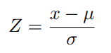

2d卷积网络中的Batch-Norm：  
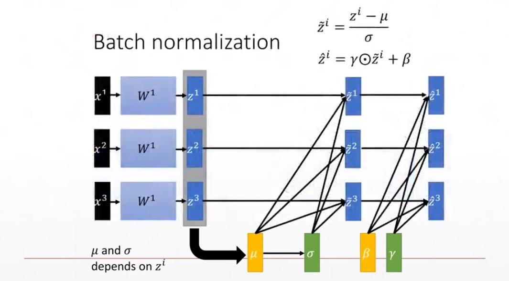

μ和σ是单词batch统计出来的，γ和β是可学习的。PyTorch会记录训练所有batch中统计出来的总的μ和σ，叫做Running-μ、Running-σ^2。推断的时候使用训练过程中的Running-μ、Running-σ^2作为平均值和方差。训练开始的时候Running-μ=0、Running-σ=1，γ=1、β=0。然后根据下面的公司进行计算：

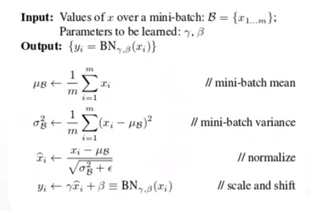

```python
import torch
import torch.nn as nn

# 定义一个批次是100，通道数是3，H*W=28*28的向量
x = torch.rand(100, 3, 28, 28)

# 定义一个Batch Normalization层，指定的是通道数
layer = nn.BatchNorm2d(3)
# 初始的Running-μ、Running-σ^2、γ和β
print('Initial Running-μ, Running-σ, γ, β:', layer.running_mean,
      layer.running_var, layer.weight, layer.bias)

# 做一次Batch Normalization
out = layer(x)
# 做一次Forward的Running-μ和Running-σ^2根据统计数据发生变化，在做一次反向传输后γ和β才会更新
print('One time  Running-μ, Running-σ, γ, β:', layer.running_mean,
      layer.running_var, layer.weight, layer.bias)
```
输出:
```
Initial Running-μ, Running-σ^2, γ, β: tensor([0., 0., 0.]) tensor([1., 1., 1.]) Parameter containing:
tensor([1., 1., 1.], requires_grad=True) Parameter containing:
tensor([0., 0., 0.], requires_grad=True)
One time  Running-μ, Running-σ^2, γ, β: tensor([0.0502, 0.0501, 0.0502]) tensor([0.9083, 0.9083, 0.9083]) Parameter containing:
tensor([1., 1., 1.], requires_grad=True) Parameter containing:
tensor([0., 0., 0.], requires_grad=True)
```
layer.affine用户开启和关闭γ、β变化，模式是True。   


## Layer Normalization
Layer Normalization的做法是对每个batch size，对所有channel的数据求平均数（μ）和标准方差（σ），然后使用z-score进行归一化处理。

## Instance Normalization
Instance Normalization的做法是对每个batch size、每个channel，对H*W的数据求平均数（μ）和标准方差（σ），然后使用z-score进行归一化处理。

## Group Normalization
Group Normalization的做法是对每个batch size、全部channel，对H*W的数据求平均数（μ）和标准方差（σ），然后使用z-score进行归一化处理。

# 实现残差网络单元
```python
import torch
import torch.nn as nn

# 实现一个残差模块(ResNet模块),输入通道数3，输出通道数量5
ch_in = 3
ch_out = 5
# 定义第一个卷积层
conv1 = nn.Conv2d(ch_in, ch_out, 3, stride=1, padding=1)
# 定义一个BN层
bn1 = nn.BatchNorm2d(ch_out)
# 定义第二个卷积层
conv2 = nn.Conv2d(ch_out, ch_out, 3, stride=1, padding=1)
# 定义二个BN层
bn2 = nn.BatchNorm2d(ch_out)

# 定义短接层，如果ch_in==ch_out，这个层不对输入的x做任何修改，直接输出
# 如果输入和输出的层数不相等，需要使用卷积核为1的卷积层改变输入层数，将它
# 变换为输出层数，这样才能将短接的x加上卷积计算的值
extra = nn.Sequential()
if ch_in != ch_out:
    extra = nn.Sequential(nn.Conv2d(ch_in, ch_out, 1), nn.BatchNorm2d(ch_out))

# 初始化输入向量
x = torch.rand(1, 3, 32, 32)
print('x shape:', x.shape)

# 计算卷积的值
out = conv1(x)
out = bn1(out)
out = torch.relu(out)
x_shortcut = extra(x)
out_res = x_shortcut + out  # 这里是重点，残差的算法在这里实现了

# 对比残差是不是卷积的结果加上短接的效果
print('out_res - out == x_shortcut的个数(总数是 5*32*32=5120):',
      (out_res - out - x_shortcut < 1e-5).sum())
```
输出：
```
x shape: torch.Size([1, 3, 32, 32])
out_res - out == x_shortcut的个数(总数是 5*32*32=5120): tensor(5120)
```

# nn.Module
## 基础用法
nn.Module类是PyTorch中所有网络层（nn.Linear、nn.BatchNorm2d、nn.Conv2d等）以及网络层容器（nn.Sequential）的基类，它可以嵌套。    
容器（例如nn.Sequential）基本用法是在构造函数中定义网络层，实例使用括号传入需要计算的数据，返回计算结果：
```python
import torch
import torch.nn as nn

# 定义一个计算网络
net = nn.Sequential(nn.Conv2d(1, 3, 3, padding=1), nn.MaxPool2d(2, 2),
                    nn.ReLU(True), nn.BatchNorm2d(3))

# 定义输入数据,batch size是8，1个通道，64*64的特征图
x = torch.rand(8, 1, 64, 64)
print('输入 x shape:', x.shape)

# 计算输出
out = net(x)
print('输入1个通道，经过容器计算后是3个通道,做了一个2*2池化，特征图从64*64缩小到32*32，应该得到[8,3,32,32]:', out.shape)

# 查看网络的网络层的参数
print('网络层的参数，0、3层有参数，1、1层没有参数：', list(net.named_parameters()))

# 查看容器的子模块
print('容器的子模块：', net.children)
print('容器的模块：', net.modules)
```
输出：
```
输入 x shape: torch.Size([8, 1, 64, 64])
输入1个通道，经过容器计算后是3个通道,做了一个2*2池化，特征图从64*64缩小到32*32，应该得到[8,3,32,32]: torch.Size([8, 3, 32, 32])
网络层的参数，0、3层有参数，1、1层没有参数： [('0.weight', Parameter containing:
tensor([[[[-0.2995, -0.2259, -0.1732],
          [ 0.2636,  0.0899,  0.2355],
          [-0.0877,  0.0706, -0.0226]]],


        [[[ 0.0620, -0.1392,  0.2703],
          [-0.0258, -0.2457, -0.1618],
          [ 0.0241, -0.1453, -0.2632]]],


        [[[-0.0120, -0.0453,  0.1097],
          [-0.0925, -0.1173, -0.0785],
          [-0.1673,  0.0479,  0.2446]]]], requires_grad=True)), ('0.bias', Parameter containing:
tensor([ 0.1125,  0.1130, -0.0745], requires_grad=True)), ('3.weight', Parameter containing:
tensor([1., 1., 1.], requires_grad=True)), ('3.bias', Parameter containing:
tensor([0., 0., 0.], requires_grad=True))]
容器的子模块： <bound method Module.children of Sequential(
  (0): Conv2d(1, 3, kernel_size=(3, 3), stride=(1, 1), padding=(1, 1))
  (1): MaxPool2d(kernel_size=2, stride=2, padding=0, dilation=1, ceil_mode=False)
  (2): ReLU(inplace=True)
  (3): BatchNorm2d(3, eps=1e-05, momentum=0.1, affine=True, track_running_stats=True)
)>
容器的模块： <bound method Module.modules of Sequential(
  (0): Conv2d(1, 3, kernel_size=(3, 3), stride=(1, 1), padding=(1, 1))
  (1): MaxPool2d(kernel_size=2, stride=2, padding=0, dilation=1, ceil_mode=False)
  (2): ReLU(inplace=True)
  (3): BatchNorm2d(3, eps=1e-05, momentum=0.1, affine=True, track_running_stats=True)
)>
```
## 自定义网络层方法
自定义一个拉直网络层
```python
import torch
import torch.nn as nn


class Flaten(nn.Module):
    # 定义一个拉直网络层
    def __init__(self):
        super(Flaten, self).__init__()

    def forward(self, input):
        print('Flaten input shape:', input.shape)
        return input.view(input.size(0), -1)


class Net(nn.Module):
    # 定义一个网络
    def __init__(self):
        super(Net, self).__init__()
        self.net = nn.Sequential(nn.Conv2d(1, 16, 3, padding=1), nn.MaxPool2d(
            2, 2), Flaten(), nn.Linear(16*14*15, 10))

    def forward(self, x):
        return self.net(x)


# 定义网络输入，batch size=16，通道=1，H*W=28*30
x = torch.rand(16, 1, 28, 30)
print('input x shape:', x.shape)

# 实例化网络对象
net = Net()

# 做一个次前向传播
out = net(x)
print('output shape:', out.shape)
```
输出：
```
input x shape: torch.Size([16, 1, 28, 30])
Flaten input shape: torch.Size([16, 16, 14, 15])
output shape: torch.Size([16, 10])
```

## 实现自己算法的方法
关键点是使用nn.Parameter将自己算法的可训练参数放入到Module的Parameter中，以实现自动计算。网络层的参数加入到了nn.Parameter，就可以方便的统一加入到优化器中。
```python
import torch
import torch.nn as nn


class Flaten(nn.Module):
    # 定义一个拉直网络层
    def __init__(self):
        super(Flaten, self).__init__()

    def forward(self, input):
        print('Flaten input shape:', input.shape)
        return input.view(input.size(0), -1)


class MyLinear(nn.Module):
    # 定义自己算法的网络层
    def __init__(self, in_channels: int, out_channels: int):
        super(MyLinear, self).__init__()

        # 定义权重和偏置，required_grad=True
        # 这些参数要加入到Module的parameter中，以实现网络的自动计算
        # 使用nn.Parameter在定义Tensor的时候就不需要加required_grad=True，自动会加上
        self.w = nn.Parameter(torch.randn(out_channels, in_channels))
        self.b = nn.Parameter(torch.randn(out_channels))

    def forward(self, input):
        return input @ self.w.T+self.b


class Net(nn.Module):
    # 定义一个网络
    def __init__(self):
        super(Net, self).__init__()
        self.net = nn.Sequential(nn.Conv2d(1, 16, 3, padding=1), nn.MaxPool2d(
            2, 2), Flaten(), MyLinear(16*14*15, 10))

    def forward(self, x):
        return self.net(x)


# 定义网络输入，batch size=16，通道=1，H*W=28*30
x = torch.rand(16, 1, 28, 30)
print('input x shape:', x.shape)

# 实例化网络对象
net = Net()

# 做一个次前向传播
out = net(x)
print('output shape:', out.shape)
```
 输出：
```
input x shape: torch.Size([16, 1, 28, 30])
Flaten input shape: torch.Size([16, 16, 14, 15])
output shape: torch.Size([16, 10])
```


# 模型的保存和加载
```python
import torch
import torch.nn as nn


class Net(nn.Module):
    # 定义网络
    def __init__(self):
        super(Net, self).__init__()
        self.net = nn.Linear(4, 3)


# 显卡设备
device = torch.device('cuda')
# 网络对象,Net类是从nn.Module派生的
net = Net()
# 将网络放入GPU，不需要像Tensor的to方法那样保存返回值，nn.Module的to返回还是本身，只是把内部的Tensor放入了GPU
net.to(device)

# 加载网络参数
net.load_state_dict(torch.load('ckpt.mdl'))

# 切换到训练状态
net.train()
# train...

# 切换到评估状态
net.eval()
# test....

# 保存训练好的网络参数
torch.save(net.state_dict(), 'ckpt.mdl')
```

# 数据增强
PyTorch在torchvision.transforms中实现图像数据的增强，通过torchvision.transforms.Compose类构造顺序数据增强方法。

# 搭建一个简单的卷积分类网络
main.py
```python
import torch
from torch import nn, optim
from torchvision import datasets, transforms
from torch.utils.data import DataLoader
from lenet5 import Lenet5
from resnet import ResNet18


def main():
    # 定义批大小
    batch_size = 32
    # 定义最大训练次数
    max_epoch = 1000
    # 定义学习率
    learning_rate = 1e-3

    # 打开训练集
    cifar_train = datasets.CIFAR10(r'D:\lesson45\cifar10', True, transform=transforms.Compose([
        transforms.Resize((32, 32)),
        transforms.ToTensor(),
        # 增加RGB标准化，这个平均值和标准差是在ImageNet上统计的结果
        transforms.Normalize(mean=[0.485, 0.456, 0.406],
                             std=[0.229, 0.224, 0.225])
    ]), download=True)
    # 加载训练集
    cifar_train = DataLoader(cifar_train, batch_size=batch_size, shuffle=True)
    # 打开测试集
    cifar_test = datasets.CIFAR10(r'D:\lesson45\cifar10', False, transform=transforms.Compose([
        transforms.Resize((32, 32)),
        transforms.ToTensor(),
        transforms.Normalize(mean=[0.485, 0.456, 0.406],
                             std=[0.229, 0.224, 0.225])

    ]), download=True)
    cifar_test = DataLoader(cifar_test, batch_size=batch_size, shuffle=True)

    # 显示数据集信息
    x, label = iter(cifar_train).next()
    print(
        f'cifar10 dataset, input shape: {x.shape}, label shape: {label.shape}')

    # 实例化模型
    model = Lenet5
    # model = ResNet18()
    print(model)

    # 定义损失函数，使用交叉熵
    criteria = nn.CrossEntropyLoss()

    # 定义优化器，使用Adam
    optimizer = optim.Adam(model.parameters(), lr=learning_rate)

    # 开始训练
    for epoch in range(max_epoch):
        # 训练
        model.train()
        for batch_idx, (x, label) in enumerate(cifar_train):
            # 得到网络输出, x: [b, 3, 32, 32] => [b, 10]
            logits = model(x)
            # 计算损失, logits：[b, 10]，label：[b]
            loss = criteria(logits, label)
            # 反向传输
            optimizer.zero_grad()
            loss.backward()
            optimizer.step()

        # 测试，告诉Torch不需要梯度计算，减少资源消耗
        model.eval()
        with torch.no_grad():
            total_correct = 0
            total_num = 0
            for x, label in cifar_test:
                # 得到网络输出
                logits = model(x)
                # 计算争取推断的数量，先取到每个batch上的最大数字所在的位置索引
                # [b, 10] => [b]
                pred = logits.argmax(dim=1)
                # 与标签比较，并累加正确的数量
                # 比如[2,1,1]与[2,2,0]比较后返回[1,0,0]，对应元素相等的返回1，不相等的返回0
                total_correct += torch.eq(pred, label).float().sum().item()
                # 记录总的测试样本数量
                total_num += x.size(0)

            print(
                f'epoch {epoch}, loss {loss.item()}, acc {total_correct/total_num}')


if __name__ == '__main__':
    main()
```
lenet5.py
```python
import torch
from torch import nn


class Lenet5(nn.Module):
    """
    for cifar10 dataset
    """

    def __init__(self):
        super(Lenet5, self).__init__()

        # 定义卷积部分
        self.conv_unit = nn.Sequential(
            # x: [b, 3, 32, 32] => [b, 6, 28, 28]
            nn.Conv2d(3, 6, 5, stride=1, padding=0),
            # x: [b, 6, 28, 28] => [b, 6, 14, 14]
            nn.AvgPool2d(2, 2, padding=0),
            # x: [b, 6, 14, 14] => [b, 16, 10, 10]
            nn.Conv2d(6, 16, 5, stride=1, padding=0),
            # x: [b, 16, 10, 10] => [b, 16, 5, 5]
            nn.AvgPool2d(2, 2, padding=0)
        )

        # 定义全连接部分
        self.fc_unit = nn.Sequential(
            # x: [b, 16*5*5] => [b, 120]
            nn.Linear(400, 120),
            nn.ReLU(),
            # x: [b, 120] => [b, 84]
            nn.Linear(120, 84),
            nn.ReLU(),
            # x: [b, 84] => [b, 10]
            nn.Linear(84, 10)
        )

    def forward(self, x):
        """
        前向传播

        Parameters
        ----------
        x : [b, 3, 32, 32]
            输入的一个批次的数据

        Returns
        -------
        [b, 10]

        """
        # x: [b, 3, 32, 32] => [b, 16, 5, 5]
        x = self.conv_unit(x)
        # x: [b, 16, 5, 5] => [b, 16*5*5]
        x = x.view(x.size(0), -1)
        # x: [b, 16*5*5] => [b, 10]
        logits = self.fc_unit(x)
        return logits


def main():
    """
    测试代码
    """
    net = Lenet5()
    print('Test Lenet5')

    x = torch.randn(2, 3, 32, 32)
    print('x shape:', x.shape)
    out = net(x)
    print('out shape:', out.shape)


if __name__ == '__main__':
    main()
```
输出：
```
Files already downloaded and verified
Files already downloaded and verified
cifar10 dataset, input shape: torch.Size([32, 3, 32, 32]), label shape: torch.Size([32])
Lenet5(
  (conv_unit): Sequential(
    (0): Conv2d(3, 6, kernel_size=(5, 5), stride=(1, 1))
    (1): AvgPool2d(kernel_size=2, stride=2, padding=0)
    (2): Conv2d(6, 16, kernel_size=(5, 5), stride=(1, 1))
    (3): AvgPool2d(kernel_size=2, stride=2, padding=0)
  )
  (fc_unit): Sequential(
    (0): Linear(in_features=400, out_features=120, bias=True)
    (1): ReLU()
    (2): Linear(in_features=120, out_features=84, bias=True)
    (3): ReLU()
    (4): Linear(in_features=84, out_features=10, bias=True)
  )
)
epoch 0, loss 1.8438501358032227, acc 0.4782
epoch 1, loss 1.275923728942871, acc 0.517
epoch 2, loss 1.5104440450668335, acc 0.5232
```

编写一个残差网络ResNet18代替Lenet5.   
resnet.py
```python
import torch
from torch import nn
from torch.nn import functional as F


class ResBlk(nn.Module):
    """
    残差单元
    """

    def __init__(self, in_channels: int, out_channels: int, stride=1):
        """


        Parameters
        ----------
        in_channels : int
            输入通道数.
        out_channels : int
            输出通道数.
        stride : int
            第一层卷积的步长，作用是缩小特征图.

        Returns
        -------
        None.

        """
        super(ResBlk, self).__init__()

        self.conv1 = nn.Conv2d(in_channels, out_channels,
                               3, stride=stride, padding=1)
        self.bn1 = nn.BatchNorm2d(out_channels)
        self.conv2 = nn.Conv2d(
            out_channels, out_channels, 3, stride=1, padding=1)
        self.bn2 = nn.BatchNorm2d(out_channels)

        self.extra = nn.Sequential(
            nn.Conv2d(in_channels, out_channels, 1, stride=stride, padding=0))

    def forward(self, x):
        """
        前向传播

        Parameters
        ----------
        x : [b, in_ch, H, W]
            输入向量.

        Returns
        -------
        [b, out_ch, H, W]

        """
        out = F.relu(self.bn1(self.conv1(x)))
        out = F.relu(self.bn2(self.conv2(out)))
        out = out + self.extra(x)
        return out


class ResNet18(nn.Module):
    """
    残差网络
    """

    def __init__(self):
        super(ResNet18, self).__init__()

        # [b, 3, H, W] => [b, 64, H, W]
        self.conv1 = nn.Sequential(
            nn.Conv2d(3, 64, 3, stride=1, padding=1), nn.BatchNorm2d(64))
        # [b, 64, H, W] => [b, 128, H/2, W/2]
        self.blk1 = ResBlk(64, 128, stride=2)
        # [b, 128, H/2, W/2] => [b, 256, H/4, W/4]
        self.blk2 = ResBlk(128, 256, stride=2)
        # [b, 256, H/4, W/4] => [b, 512, H/8, W/8]
        self.blk3 = ResBlk(256, 512, stride=2)
        # [b, 512, H/8, W/8] => [b, 512, H/16, W/16]
        self.blk4 = ResBlk(512, 512, stride=2)

        # [b, 512*H/16*W/16] => [b, 10]
        self.outlayer = nn.Linear(2048, 10)

    def forward(self, x):
        """
        前向传播

        Parameters
        ----------
        x : [b, in_ch, H, W]
            DESCRIPTION.

        Returns
        -------
        [b, out_ch, H, W]

        """

        # [b, in_ch, H, W] => [b, 64, H, W]
        x = F.relu(self.conv1(x))

        # [b, 64, H, W] => [b, 1024, H, W]
        x = self.blk1(x)
        x = self.blk2(x)
        x = self.blk3(x)
        x = self.blk4(x)

        x = self.outlayer(x.view(x.size(0), -1))
        return x


def main():
    """
    单元测试

    Returns
    -------
    None.

    """

    net = ResNet18()

    x = torch.rand(32, 3, 32, 32)
    print('input x shape:', x.shape)

    out = net(x)
    print('output shape:', out.shape)


if __name__ == '__main__':
    main()
```
输出：
```
Files already downloaded and verified
Files already downloaded and verified
cifar10 dataset, input shape: torch.Size([32, 3, 32, 32]), label shape: torch.Size([32])
ResNet18(
  (conv1): Sequential(
    (0): Conv2d(3, 64, kernel_size=(3, 3), stride=(1, 1), padding=(1, 1))
    (1): BatchNorm2d(64, eps=1e-05, momentum=0.1, affine=True, track_running_stats=True)
  )
  (blk1): ResBlk(
    (conv1): Conv2d(64, 128, kernel_size=(3, 3), stride=(2, 2), padding=(1, 1))
    (bn1): BatchNorm2d(128, eps=1e-05, momentum=0.1, affine=True, track_running_stats=True)
    (conv2): Conv2d(128, 128, kernel_size=(3, 3), stride=(1, 1), padding=(1, 1))
    (bn2): BatchNorm2d(128, eps=1e-05, momentum=0.1, affine=True, track_running_stats=True)
    (extra): Sequential(
      (0): Conv2d(64, 128, kernel_size=(1, 1), stride=(2, 2))
    )
  )
  (blk2): ResBlk(
    (conv1): Conv2d(128, 256, kernel_size=(3, 3), stride=(2, 2), padding=(1, 1))
    (bn1): BatchNorm2d(256, eps=1e-05, momentum=0.1, affine=True, track_running_stats=True)
    (conv2): Conv2d(256, 256, kernel_size=(3, 3), stride=(1, 1), padding=(1, 1))
    (bn2): BatchNorm2d(256, eps=1e-05, momentum=0.1, affine=True, track_running_stats=True)
    (extra): Sequential(
      (0): Conv2d(128, 256, kernel_size=(1, 1), stride=(2, 2))
    )
  )
  (blk3): ResBlk(
    (conv1): Conv2d(256, 512, kernel_size=(3, 3), stride=(2, 2), padding=(1, 1))
    (bn1): BatchNorm2d(512, eps=1e-05, momentum=0.1, affine=True, track_running_stats=True)
    (conv2): Conv2d(512, 512, kernel_size=(3, 3), stride=(1, 1), padding=(1, 1))
    (bn2): BatchNorm2d(512, eps=1e-05, momentum=0.1, affine=True, track_running_stats=True)
    (extra): Sequential(
      (0): Conv2d(256, 512, kernel_size=(1, 1), stride=(2, 2))
    )
  )
  (blk4): ResBlk(
    (conv1): Conv2d(512, 512, kernel_size=(3, 3), stride=(2, 2), padding=(1, 1))
    (bn1): BatchNorm2d(512, eps=1e-05, momentum=0.1, affine=True, track_running_stats=True)
    (conv2): Conv2d(512, 512, kernel_size=(3, 3), stride=(1, 1), padding=(1, 1))
    (bn2): BatchNorm2d(512, eps=1e-05, momentum=0.1, affine=True, track_running_stats=True)
    (extra): Sequential(
      (0): Conv2d(512, 512, kernel_size=(1, 1), stride=(2, 2))
    )
  )
  (outlayer): Linear(in_features=2048, out_features=10, bias=True)
)
epoch 0, loss 1.8792897462844849, acc 0.6041
epoch 1, loss 0.8214048743247986, acc 0.7065
epoch 2, loss 0.171108216047287, acc 0.7554
epoch 3, loss 0.8176620006561279, acc 0.7709
```
可见ResNet18的效果明显好于Lenet5.

# RNN
一个单层的RNN

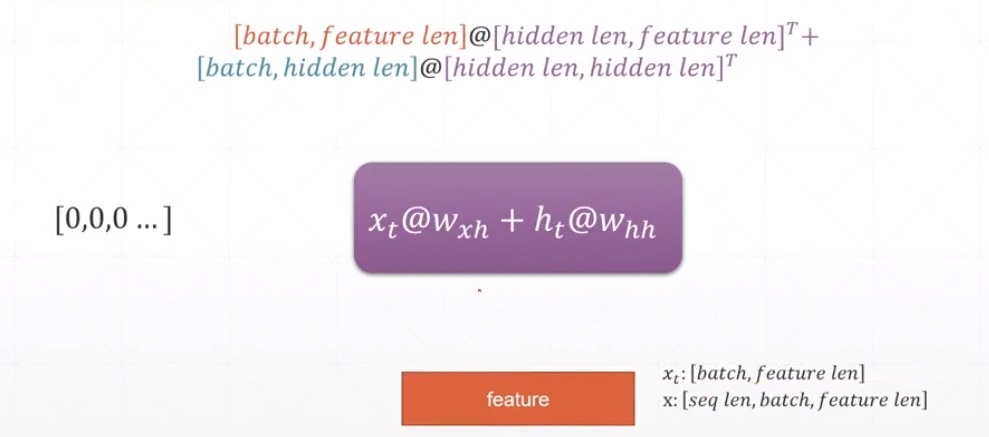

```python
import torch
import torch.nn as nn

# 词向量维度（feature len）：100， 计算向量维度（hidden len）：10
rnn = nn.RNN(100, 10)
# RNN层参数名字中，ih是Wxh权重和偏置，hh是Whh权重和偏置，l0表示第1层
print('rnn paramters name:', rnn._parameters.keys())

print(f'Wxh(weight_ih_l0) shape: {rnn.weight_ih_l0.shape}, Whh(weight_hh_l0) shape: {rnn.weight_hh_l0.shape}')
print(f'Bxh(bias_ih_l0) shape: {rnn.bias_ih_l0.shape}, Bhh(bias_hh_l0) shape: {rnn.bias_hh_l0.shape}')

# 进行一次计算，每句话有15个词，也就是序列（seq_len）的长度，一个批次3句，词向量维度是100
x = torch.rand(15, 3, 100)
# rnn层的forward返回2个向量，第一个是每一个词的h，第二个是当最后一个词的h
# 因此out的最后一个元素向量应该与h是同一个，相等
out, h = rnn(x)
# out应该有15个词的计算结果，每个结果是[句子数(batch size)：3,结果向量维度：10]
print('out shape:', out.shape)
# h是一次的结果，第一维是共有几个RNN层，这里是1，一共有一个计算结果
print('h shape', h.shape)
```
输出：
```
rnn paramters name: odict_keys(['weight_ih_l0', 'weight_hh_l0', 'bias_ih_l0', 'bias_hh_l0'])
Wxh(weight_ih_l0) shape: torch.Size([10, 100]), Whh(weight_hh_l0) shape: torch.Size([10, 10])
Bxh(bias_ih_l0) shape: torch.Size([10]), Bhh(bias_hh_l0) shape: torch.Size([10])
out shape: torch.Size([15, 3, 10])
h shape torch.Size([1, 3, 10])
```

一个两层的RNN

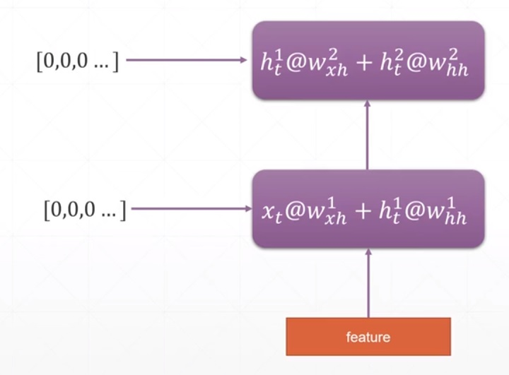

```python
import torch
import torch.nn as nn

# 词向量维度（feature len）：100， 计算向量维度（hidden len）：10
rnn = nn.RNN(100, 10, num_layers=2)
# RNN层参数名字中，ih是Wxh权重和偏置，hh是Whh权重和偏置，l0表示第1层
print('rnn paramters name:', rnn._parameters.keys())

print(f'Wxh0(weight_ih_l0) shape: {rnn.weight_ih_l0.shape}, Whh0(weight_hh_l0) shape: {rnn.weight_hh_l0.shape}')
print(f'Wxh1(weight_ih_l1) shape: {rnn.weight_ih_l1.shape}, Whh1(weight_hh_l1) shape: {rnn.weight_hh_l1.shape}')
print(f'Bxh0(bias_ih_l0) shape: {rnn.bias_ih_l0.shape}, Bhh0(bias_hh_l0) shape: {rnn.bias_hh_l0.shape}')
print(f'Bxh1(bias_ih_l1) shape: {rnn.bias_ih_l1.shape}, Bhh1(bias_hh_l1) shape: {rnn.bias_hh_l1.shape}')

# 进行一次计算，每句话有15个词，一个批次3句，词向量维度是100
x = torch.rand(15, 3, 100)
# rnn层的forward返回2个向量，第一个是每一个词的h，第二个是当最后一个词的h
# 因此out的最后一个元素向量应该与h是同一个，相等
out, h = rnn(x)
# out应该有15个词的计算结果，每个结果是[句子数(batch size)：3,结果向量维度：10]
print('out shape:', out.shape)
# h是每层最后一次的结果，第一维是共有几个RNN层，这里是2，一共有一个计算结果
print('h shape', h.shape)
```
输出：
```
rnn paramters name: odict_keys(['weight_ih_l0', 'weight_hh_l0', 'bias_ih_l0', 'bias_hh_l0', 'weight_ih_l1', 'weight_hh_l1', 'bias_ih_l1', 'bias_hh_l1'])
Wxh0(weight_ih_l0) shape: torch.Size([10, 100]), Whh0(weight_hh_l0) shape: torch.Size([10, 10])
Wxh1(weight_ih_l1) shape: torch.Size([10, 10]), Whh1(weight_hh_l1) shape: torch.Size([10, 10])
Bxh0(bias_ih_l0) shape: torch.Size([10]), Bhh0(bias_hh_l0) shape: torch.Size([10])
Bxh1(bias_ih_l1) shape: torch.Size([10]), Bhh1(bias_hh_l1) shape: torch.Size([10])
out shape: torch.Size([15, 3, 10])
h shape torch.Size([2, 3, 10])
```

使用RNNCell手动循环一句话的所有词：
```python
import torch
import torch.nn as nn

# 定义一个RNN层，每个词用100维向量表示，经过计算后输出20维向量
cell = nn.RNNCell(100, 20)

# 定义历史结果保存向量，batch size是3，维度是RNNCell的输出，20
h = torch.zeros(3, 20)

# 输入数据，每句话最多由15个词组成，batch size是3，表示词的向量维度是100
# 按顺序循环这个批次的所有词，累加结果h
x = torch.rand(15, 3, 100)
for word_idx in range(15):
    h = cell(x[word_idx], h)

print('h shape:', h.shape)

# 定义一个2层的RNN，第一层输入词的维度是100，输出是30
# 第二层的输入是来自与第一层的输出，因此输入维度必须是30，输出我们定为20
cell1 = nn.RNNCell(100, 30)
cell2 = nn.RNNCell(30, 20)

# 每一层对应一个记忆，batch size是3
h1 = torch.zeros(3, 30)
h2 = torch.zeros(3, 20)

# 按顺序循环所有词
for word_idx in range(15):
    h1 = cell1(x[word_idx], h1)
    h2 = cell2(h1, h2)

print('h1 shape:', h1.shape)
print('h2 shape:', h2.shape)
```
输出：
```
h shape: torch.Size([3, 20])
h1 shape: torch.Size([3, 30])
h2 shape: torch.Size([3, 20])
```

# 时间序列预测
```python
import torch
import torch.nn as nn
import numpy as np
from matplotlib import pyplot as plt

"""
使用RNN预测一个正选曲线
原理是这样的：

"""

# 定义超参数
num_time_steps = 50
input_size = 1
hidden_size = 16
output_size = 1
lr = 0.01


class Net(nn.Module):
    """
    曲线预测RNN网络
    """

    def __init__(self):
        # 确保首先调用基类的初始化，否则后面网络层的参数无法被Module管理
        super(Net, self).__init__()

        self.rnn = nn.RNN(input_size, hidden_size,
                          num_layers=1, batch_first=True)
        for p in self.rnn.parameters():
            if(p.dim() < 2):
                continue
            nn.init.kaiming_normal(p)

        self.linear = nn.Linear(hidden_size, output_size)

    def forward(self, x, hidden_prev):
        out, hidden_prev = self.rnn(x, hidden_prev)
        # out to linear: [b,seq,h] => [b,seq*h]
        out = out.view(-1, hidden_size*input_size)
        out = self.linear(out)
        # linear out to RNN out: [b,output_size] => [b,seq,h]
        out = out.unsqueeze(dim=0)
        return out, hidden_prev


# 实例化模型
model = Net()
# 损失函数
criteria = nn.MSELoss()
# 优化器
optimizer = torch.optim.Adam(model.parameters(), lr)


# 开始训练
for i in range(6000):
    # 制作一个batch size是1的RNN输入和真实值数据
    # 随机产生一段正选曲线的X、Y坐标，共50个点
    # 随机找到一个开始点
    start = np.random.randint(3, size=1)[0]
    # 在范围10内生成等距的50个点，10大约是3个Pi，也就是3个周期多的正选曲线
    time_steps = np.linspace(start, start+10, num_time_steps)
    # 计算正选曲线的值
    data = np.sin(time_steps)
    data = data.reshape(num_time_steps, 1)
    # 输入时间序列，从第0个开始，总数去掉一个，并整形为网络输入的向量，[batch size,seq len, 词向量长度]
    x = torch.tensor(data[:-1]).float().view(1, num_time_steps-1, 1)
    # 真实值时间序列，从第1个开始，总数去掉一个，这样这好比x晚一个时刻，x的n时刻计算后的真实值是n+1时刻
    y = torch.tensor(data[1:]).float().view(1, num_time_steps-1, 1)

    # RNN记忆
    hidden_prev = torch.zeros([1, 1, hidden_size])

    # 放入网络计算
    output, hidden_prev = model(x, hidden_prev)
    # 从计算图中脱离出来，下个循环要作为没有梯度关联的向量作为网络的输入
    hidden_prev = hidden_prev.detach()

    # 计算损失
    loss = criteria(output, y)
    # 优化网络参数
    optimizer.zero_grad()
    loss.backward()
    # 对梯度的最大值做限制，防止梯度爆炸
    nn.utils.clip_grad_norm_(model.parameters(), 10)
    optimizer.step()

    if i % 100 == 0:
        print(f'Iteration: {i}, loss {loss}')

# 使用训练好的网络预测曲线
# 随机产生一段正选曲线的X、Y坐标，共50个点
start = np.random.randint(3, size=1)[0]
time_steps = np.linspace(start, start+10, num_time_steps)
data = np.sin(time_steps)
data = data.reshape(num_time_steps, 1)
x = torch.tensor(data[:-1]).float().view(1, num_time_steps-1, 1)

# 预测值列表
predictions = []
# 取曲线上的第一点作为输入，让网络预测之后的点
with torch.no_grad():
    input = x[:, 0, :].view(1, 1, 1)  # 第1位取一个后会使向量从三维降到2维，取1个元素的维度被消掉了，因此要增加回来
    hidden_prev = torch.zeros([1, 1, hidden_size])
    for _ in range(x.shape[1]):
        pred, hidden_prev = model(input, hidden_prev)
        input = pred
        predictions.append(pred.detach().numpy().ravel()[0])


# 显示实际曲线和预测曲线
x = x.data.numpy().ravel()
plt.scatter(time_steps[:-1], x, s=90)
plt.plot(time_steps[:-1], x)

plt.scatter(time_steps[1:], predictions)
plt.show()
```
输出：
```
nn.init.kaiming_normal_.
  nn.init.kaiming_normal(p)
Iteration: 0, loss 0.13890255987644196
Iteration: 100, loss 0.002004752866923809
Iteration: 200, loss 0.0007773848483338952
Iteration: 300, loss 0.0010097427293658257
Iteration: 400, loss 0.00025156346964649856
...
```

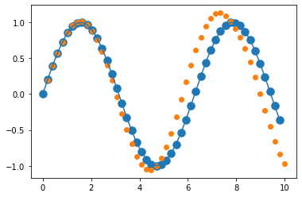    
&emsp; &emsp; &emsp; &emsp; 真实曲线 -- 蓝色，预测曲线 -- 橙色

# LSTM
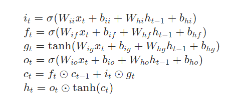
```python
import torch
import torch.nn as nn

# 定义一个3层的LSTM，输入是100维向量，输出是12维向量
# 对于权重和偏置，第1层输入是100维，输出是4*12=48维
# 3个门+1个输入=4，参见公式，把这些参数矩阵连接到了一起
lstm = nn.LSTM(100, 12, num_layers=3)
print('LSTM parameters names:', lstm._parameters.keys())
print('--------------')
print('weight_ih_l0 shape: ', lstm.weight_ih_l0.shape)
print('bias_ih_l0 shape: ', lstm.bias_ih_l0.shape)
print('weight_hh_l0 shape: ', lstm.weight_hh_l0.shape)
print('bias_hh_l0 shape: ', lstm.bias_hh_l0.shape)
print('--------------')
print('weight_ih_l1 shape: ', lstm.weight_ih_l1.shape)
print('bias_ih_l1 shape: ', lstm.bias_ih_l1.shape)
print('weight_hh_l1 shape: ', lstm.weight_hh_l1.shape)
print('bias_hh_l1 shape: ', lstm.bias_hh_l1.shape)
print('--------------')
print('weight_ih_l2 shape: ', lstm.weight_ih_l2.shape)
print('bias_ih_l2 shape: ', lstm.bias_ih_l2.shape)
print('weight_hh_l2 shape: ', lstm.weight_hh_l2.shape)
print('bias_hh_l2 shape: ', lstm.bias_hh_l2.shape)

# 定义输入，序列长度是10，批次是3，词向量维度是100
x = torch.rand(10, 4, 100)
# 计算输出，lstm需要输入3个向量，样本x，后面是上一时刻的记忆h和词状态c
# 输出的是每个序列的结果向量和最后时刻的记忆和和词状态c
out, (h, c) = lstm(x)
print('*************')
# out第1维是序列长度10，第2维是批次4，第3维是结果向量长度12
print('out shape:', out.shape)
# h和c维度一样，第1维是网络层数3，第2维是批次4，第3维是结果向量长度12
print('h shape:', h.shape)
print('c shape:', c.shape)
```
输出：
```
LSTM parameters names: odict_keys(['weight_ih_l0', 'weight_hh_l0', 'bias_ih_l0', 'bias_hh_l0', 'weight_ih_l1', 'weight_hh_l1', 'bias_ih_l1', 'bias_hh_l1', 'weight_ih_l2', 'weight_hh_l2', 'bias_ih_l2', 'bias_hh_l2'])
--------------
weight_ih_l0 shape:  torch.Size([48, 100])
bias_ih_l0 shape:  torch.Size([48])
weight_hh_l0 shape:  torch.Size([48, 12])
bias_hh_l0 shape:  torch.Size([48])
--------------
weight_ih_l1 shape:  torch.Size([48, 12])
bias_ih_l1 shape:  torch.Size([48])
weight_hh_l1 shape:  torch.Size([48, 12])
bias_hh_l1 shape:  torch.Size([48])
--------------
weight_ih_l2 shape:  torch.Size([48, 12])
bias_ih_l2 shape:  torch.Size([48])
weight_hh_l2 shape:  torch.Size([48, 12])
bias_hh_l2 shape:  torch.Size([48])
*************
out shape: torch.Size([10, 4, 12])
h shape: torch.Size([3, 4, 12])
c shape: torch.Size([3, 4, 12])
```

LSTMCell，LSTM底层单元，没有自动循环序列功能。       
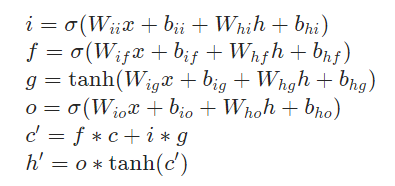    
对于一个1层的网络：
```python
import torch
import torch.nn as nn

# 定义一个LSTM底层单元，输入100维向量，输出12维向量
# 对于权重和偏置，维度大小计算与nn.LSTM一样
cell = nn.LSTMCell(100, 12)
print('cell parameters names:', cell._parameters.keys())
print('------------')
print('weight_ih shape:', cell.weight_ih.shape)
print('bias_ih shape:', cell.bias_ih.shape)
print('weight_hh shape:', cell.weight_hh.shape)
print('bias_hh shape:', cell.bias_hh.shape)

# 定义单元的记忆和词状态，假设都是0，批次是3，维度是12
h0 = torch.zeros(3, 12)
c0 = torch.zeros(3, 12)
# 定义网络输入，批次是3，词向量维度是100，单元每次计算一个时刻的数据，因此就没有了序列长度维度
x = torch.rand(3, 100)
# 单元输入当前时刻的数据和上一时刻网络的记忆h及词状态c，输出当前时刻的网络的记忆h及词状态c
h, c = cell(x, [h0, c0])
print('************')
print('h shape:', h.shape)
print('c shape:', c.shape)
```
输出：
```
cell parameters names: odict_keys(['weight_ih', 'weight_hh', 'bias_ih', 'bias_hh'])
------------
weight_ih shape: torch.Size([48, 100])
bias_ih shape: torch.Size([48])
weight_hh shape: torch.Size([48, 12])
bias_hh shape: torch.Size([48])
************
h shape: torch.Size([3, 12])
c shape: torch.Size([3, 12])
```

对于一个2层的网络：
```python
import torch
import torch.nn as nn

# 定义2个LSTM底层单元，输入100维向量，输出12维向量
# 对于权重和偏置，维度大小计算与nn.LSTM一样
cell1 = nn.LSTMCell(100, 30)
cell2 = nn.LSTMCell(30, 12)
print('cell1 parameters names:', cell1._parameters.keys())
print('cell2 parameters names:', cell1._parameters.keys())
print('------ cell1 ------')
print('weight_ih shape:', cell1.weight_ih.shape)
print('bias_ih shape:', cell1.bias_ih.shape)
print('weight_hh shape:', cell1.weight_hh.shape)
print('bias_hh shape:', cell1.bias_hh.shape)
print('------ cell2 ------')
print('weight_ih shape:', cell2.weight_ih.shape)
print('bias_ih shape:', cell2.bias_ih.shape)
print('weight_hh shape:', cell2.weight_hh.shape)
print('bias_hh shape:', cell2.bias_hh.shape)

# 定义单元的记忆和词状态，假设都是0，批次是3，维度是12
h1 = torch.zeros(3, 30)
c1 = torch.zeros(3, 30)
h2 = torch.zeros(3, 12)
c2 = torch.zeros(3, 12)
# 定义网络输入，批次是3，词向量维度是100，单元每次计算一个时刻的数据，因此就没有了序列长度维度
x = torch.rand(3, 100)
# 单元1输入当前时刻的x数据和上一时刻网络的记忆h1及词状态c1，输出当前时刻的网络的记忆h1及词状态c1
h1, c1 = cell1(x, [h1, c1])
# 单元2输入当前时刻的h1数据和上一时刻网络的记忆h2及词状态c2，输出当前时刻的网络的记忆h2及词状态c2
h2, c2 = cell2(h1, [h2, c2])
print('************')
print('------ cell1 ------')
print('h1 shape:', h1.shape)
print('c1 shape:', c1.shape)
print('------ cell2 ------')
print('h2 shape:', h2.shape)
print('c2 shape:', c2.shape)
```
输出：
```
cell1 parameters names: odict_keys(['weight_ih', 'weight_hh', 'bias_ih', 'bias_hh'])
cell2 parameters names: odict_keys(['weight_ih', 'weight_hh', 'bias_ih', 'bias_hh'])
------ cell1 ------
weight_ih shape: torch.Size([120, 100])
bias_ih shape: torch.Size([120])
weight_hh shape: torch.Size([120, 30])
bias_hh shape: torch.Size([120])
------ cell2 ------
weight_ih shape: torch.Size([48, 30])
bias_ih shape: torch.Size([48])
weight_hh shape: torch.Size([48, 12])
bias_hh shape: torch.Size([48])
************
------ cell1 ------
h1 shape: torch.Size([3, 30])
c1 shape: torch.Size([3, 30])
------ cell2 ------
h2 shape: torch.Size([3, 12])
c2 shape: torch.Size([3, 12])
```

双向LSTM，nn.LSTM的参数bidirectional设置为True时，代表使用双向LSTM（Bi-directional LSTM），网络如下图：    
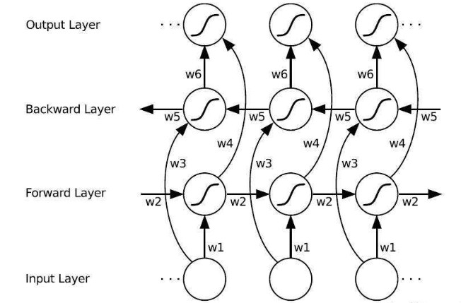    
双向LSTM包含Forward层和Backward层，共同链接着输出层，其中包含了6个共享权值w1-w6。在Forward层从1时刻到t时刻正向计算一遍，获得并保存每一个时刻向前隐含层的输出。在Backward层沿着时刻t到时刻1反向计算一遍，获得并保存每一个时刻向后隐含层的输出。最后在每一个时刻结合Forward层和Backward层的相应时刻输出的结果获得最终的输出，用数学表达式以下：    
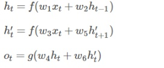    


# 数据集的加载
从torch.utils.data.Dataset派生数据集加载类，实现 __len__ 和 __getitem__ 方法，__len__ 返回数据集中样本的数量，__getitem__ 返回一个样本的数据。    
展示原理的一个示例：
```python
from torch.utils.data import Dataset, DataLoader
import numpy as np


class NumbersDataset(Dataset):
    """
    数据集示例，展示原理
    """

    def __init__(self, training=True):
        super(NumbersDataset, self).__init__()

        if training:
            self.samples = np.arange(1, 101)
        else:
            self.samples = np.arange(101, 151)

    def __len__(self):
        """
        重写获取样本总数方法

        Returns
        -------
        int
            样本总数.

        """
        return len(self.samples)

    def __getitem__(self, idx):
        """
        获取一个样本

        Parameters
        ----------
        idx : int
            样本的索引号.

        Returns
        -------
        int
            样本数据.

        """
        return self.samples[idx]


# 实例化数据集
dataset = NumbersDataset()
train_loader = DataLoader(dataset, batch_size=32, shuffle=True)

# 训练网络
for batch_idx, data in enumerate(train_loader):
    print(f'batch_idex {batch_idx}, data: {data}')
```
输出：
```
batch_idex 0, data: tensor([ 63,  65,  31,   3,  53,  70,  51,  75,  48,  27,  62,  39, 100,  79,
         78,  32,  58,  55,  93,  12,  25,  56,   8,  50,  17,  24,  49,  47,
         37,   5,  29,  88], dtype=torch.int32)
batch_idex 1, data: tensor([ 1, 81, 23, 97, 85, 28, 36,  2,  6, 26,  4, 13, 11, 64, 42, 43, 66, 76,
        90, 89,  7, 21, 46, 67, 92, 99,  9, 83, 34, 87, 10, 22],
       dtype=torch.int32)
batch_idex 2, data: tensor([19, 16, 71, 82, 30, 73, 68, 98, 95, 74, 35, 20, 94, 59, 41, 57, 84, 86,
        69, 91, 33, 44, 52, 45, 14, 60, 72, 15, 18, 77, 38, 61],
       dtype=torch.int32)
batch_idex 3, data: tensor([40, 54, 80, 96], dtype=torch.int32)
```

从磁盘加载图片示例：
```python
import os
import glob
import torch
from torch.utils.data import Dataset, DataLoader
from torchvision import transforms
from PIL import Image
from matplotlib import pyplot as plt
from visdom import Visdom


class DiskImageDataset(Dataset):
    """
    从磁盘加载图片数据集示例
    """

    def __init__(self, root, resize):
        """
        构造函数

        Parameters
        ----------
        root : string
            数据集的磁盘文件夹.
        resize : int or tuple(H, W)
            输入一个数字原图保持比例，短边缩小指定大小；如果图像的高宽将拉伸缩小到指定宽高.

        Returns
        -------
        None.

        """
        super(DiskImageDataset, self).__init__()

        self.root = root
        self.resize = resize

        # 创建名字映射到标签的字典
        # root下文件夹名字作为名字（name），按字符排序后的名字从0开始的索引号作为label
        names = [n for n in os.listdir(
            root) if os.path.isdir(os.path.join(root, n))]
        names.sort()
        self.name2label = {names[i]: i for i in range(len(names))}
        print(f'Dataset {root}, name:label: {self.name2label}')

        # 建立文件路径和标签列表
        print(f'----------- Dataset({root}) Description -----------')
        self.samples = []
        prev_count = 0
        for name in self.name2label.keys():
            self.samples.extend([(p, self.name2label[name])
                                for p in glob.glob(os.path.join(root, name, '*.jpg'))])
            print(f'{name}({self.name2label[name]}):', len(
                self.samples)-prev_count)
            prev_count = len(self.samples)
        print('Total number of Images:', len(self.samples))

    def __len__(self):
        """
        重写获取样本总数方法

        Returns
        -------
        int
            样本总数.

        """
        return len(self.samples)

    def __getitem__(self, idx):
        """
        获取一个样本

        Parameters
        ----------
        idx : int
            样本的索引号.

        Returns
        -------
        bytes,int
            样本数据和标签.

        """

        # 读取图片的路径和标签
        path, label = self.samples[idx]

        # 创建一个transform
        tf = transforms.Compose([
            lambda x:Image.open(x).convert('RGB'),  # 打开图片，转换成RGB格式
            # 为了数据选择后中心裁剪不出现填充的黑边，先得放大一下
            transforms.Resize(
                (int(self.resize[0]*1.1), int(self.resize[1]*1.1))),
            transforms.RandomRotation(15),  # 数据集增强，随机旋转
            transforms.CenterCrop(self.resize),  # 中心裁剪，去掉旋转的黑边
            transforms.ToTensor(),
            transforms.Normalize(mean=[0.485, 0.456, 0.406], std=[
                                 0.229, 0.224, 0.225])
            # 一般需要对图像做一个正则化，这个均值和方差是ImageNet的统计结果
        ])

        return tf(path), label

    def denormalize(self, x_hat):
        """
        将正则化的图像还原成原图

        Parameters
        ----------
        x_hat : [C_hat, H_hat, W_hat]
            正则化后的图像数据.

        Returns
        -------
        x : [C, H, W]
            还原后的图像数据.

        """
        # [R, G, G]
        mean = [0.485, 0.456, 0.406]
        std = [0.229, 0.224, 0.225]

        # x_hat=(x-mean)/std
        # x=x_hat*std+mean
        # x: [C, H, W]
        # 为了可以与通过广播与x计算，需要将mean和std调整维度: [3] => [3,1,1]
        mean = torch.tensor(mean).unsqueeze(1).unsqueeze(1)
        std = torch.tensor(std).unsqueeze(1).unsqueeze(1)

        x = x_hat*std+mean
        return x


# 实例化数据集
dataset = DiskImageDataset(r'd:\images', (64, 64))

# ptorch已经实现了标准磁盘目录数据集的加载类，根目录下面一个文件夹是一个类别的图片
# tf是一个创建一个transform，参见DiskImageDataset中的定义方式
#dataset = torchvision.datasets.ImageFolder(r'd:\images',transform=tf)
# 通过class_to_idx成员查看自动生成数据集的类别和索引的对应关系
#print('label vs index:', dataset.class_to_idx)

# 数据加载器，dataset不一定是batch size的整数倍，避免最后一个batch不全，将drop_last
train_loader = DataLoader(dataset, batch_size=32, shuffle=True, drop_last=True)

# 可视化客户端
viz = Visdom()

# 训练网络
for batch_idx, data in enumerate(train_loader):
    print(
        f'batch_idex {batch_idx}, data X shape: {data[0].shape}, data Y shape: {data[1].shape}')
    # 将图像显示出来，验证数据集中图像数据的正确性
    # 验证很重要，首先要保证给网络数据的正确性，才能谈到训练网络，才可能得到效果
    # 第一种验证方法，使用matplotlib显示一张图片，这种方法只能看一个batch的一个数据，不推荐
    plt.figure()
    plt.imshow(
        ((dataset.denormalize(data[0][0].detach()).numpy()*255).astype(int)).transpose(1, 2, 0))
    # 第二种方法，使用Visdom服务，显示一个batch的图片和标签，充分验证数据的正确性
    viz.images(dataset.denormalize(
        data[0]), nrow=8, win='batch', opts={'title': 'batch'})
    viz.text(str(data[1].numpy()), win='label')
```
输出：
```
Dataset d:\images, name:label: {'其它': 0, '狗': 1, '猫': 2, '老虎': 3}
----------- Dataset(d:\images) Description -----------
其它(0): 7
狗(1): 10
猫(2): 10
老虎(3): 10
Total number of Images: 37
batch_idex 0, data X shape: torch.Size([32, 3, 32, 32]), data Y shape: torch.Size([32])
```


