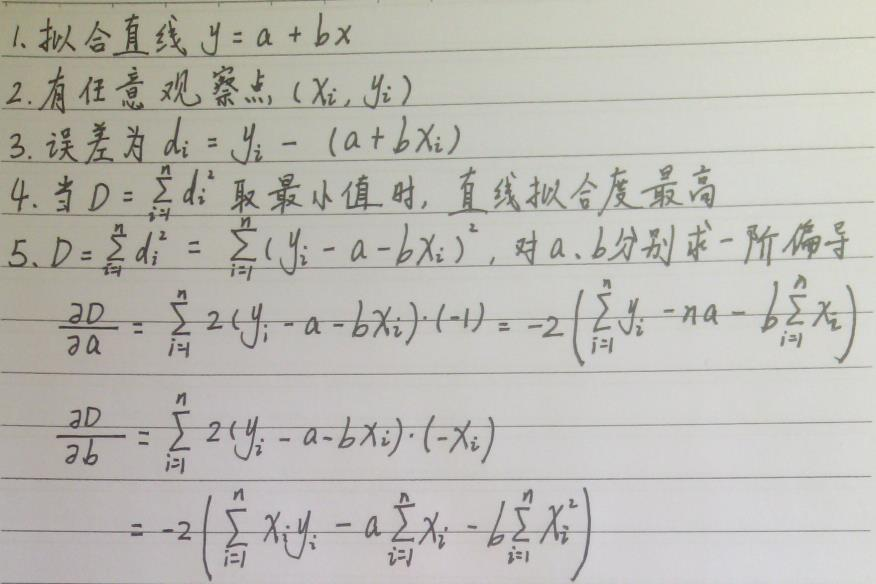
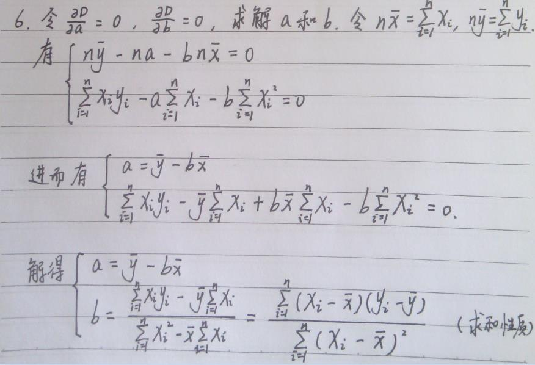
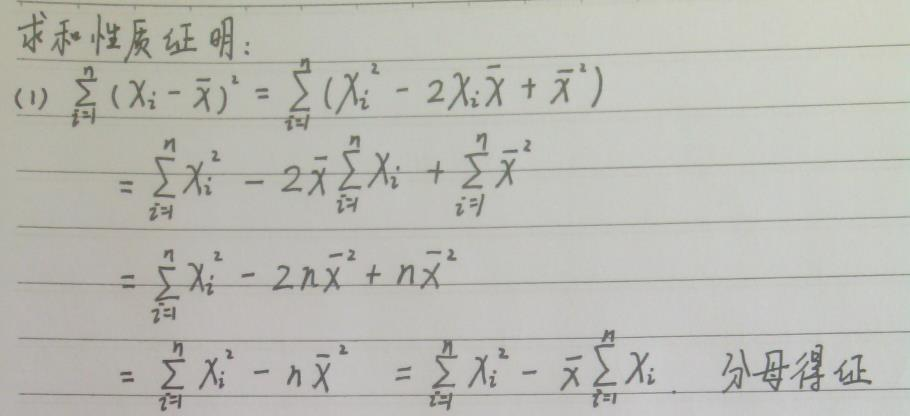

* [xlnx 当x趋近于0的极限证明](#xlnx-当x趋近于0的极限证明)
* [导数表](#导数表)
* [描述统计学](#描述统计学)
* [普通最小二乘法的推导证明](#普通最小二乘法的推导证明)

# xlnx 当x趋近于0的极限证明

# 导数表

# 描述统计学
参考资料《[看懂数据，有这4个武器就够了](https://zhuanlan.zhihu.com/p/28060465)》

# 普通最小二乘法的推导证明
(1) 公式推导   
   
   

(2) 求和性质    
求和性质，具体可以参考Introductory Econometrics A Modern Approach (Fourth Edition) 一书（计量经济学导论，第4版，杰弗里·M·伍德里奇 著）的附录A。   
   
    

(3) 一般形式   
有了上述推导证明，普通最小二乘法一般形式可以写成（字母盖小帽表示估计值，具体参考应用概率统计）：   
   

